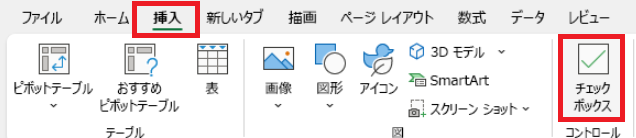

# Excel(エクセル)のつかいかた

## 1 Excelの画面構成

### 1.1 Excel(エクセル)とは何者か

Excel(エクセル)は、「スプレッドシート」をあつかうソフトウェアです。日本では「表計算ソフト」と呼ばれます。スプレッドシートは「縦横のマス目で区切られた表」です。 
データを記入して、それらの合計や平均を計算するために使います。

2025年現在、表計算ソフトは多機能化しており、表計算だけでなく、グラフの描画や基本的なデータベース機能(検索やソート)、さらに画像や音声をあつかう機能まで備えています。

### 1.2 画面の見かた

Excelを起動すると、「ブック」を選択する画面が表示されます。ブックはExcelのファイルのことです。「空白のブック」をクリックして、新しいブックを作成してください。 
ブックを作成すると、次のような画面が表示されます。

空白のマス目が並んでいる部分が「ワークシート(作業用紙)」で、ここにデータを書き込みます。ワークシートのマス目には「行番号」と「列番号」が割り当てられています。

1. タブ: 表示するリボンの種類を切り替えます。
2. リボン: タブで選択した機能が表示されます。
3. 数式バー: セルに入力されたデータや数式を表示します。
4. 行番号: 縦方向の位置で、左側の`1`から始まる数字であらわされます。
5. 列番号: 横方向の位置で、上側の`A`から始まる英字であらわされます。
6. アクティブ・セル: 現在の作業対象のセルです。
7. シート・タブ: シート(後述)を切り替えます。

## 2 表の書き方

### 2.1 表の基本

表の基本的な書き方では、まず一番上の、行番号`1`の行に「見出し」を書きます。見出しはその下に書くデータの説明です。

そして、見出しの下にデータを縦に並べて書いていきます。以下の例は、架空のスーパーの売り上げデータを表にしたものです。

| 分類 | 第１四半期 | 第２四半期 |
|:----:|:---------:|:---------:|
| 野菜 | 40,000 | 50,000 |
| 果物 | 10,000 | 30,000 |
| 惣菜 | 80,000 | 40,000 |
| パン | 30,000 | 15,000 |

最初の行が見出しです。見出しの下に、対応するデータが並びます。

### 2.2 セルの操作

Excelでセルを操作するときは、マウスポインタの形状に注意してください。同じようにマウスでクリックまたはドラッグしても、操作をはじめる時点でのマウスポインタの形状によって動作が異なるからです。

| 動作 | 形状 | いつ |
|:-----|:-----|:-----|
| セルの選択 | 白い十字 | マウスポインタを、アクティブセルの内側、 または選択していないセルの上に置く |
| セルの移動 | 手 | マウスポインタを、セルのふちに置く |
| オートフィル | 黒い十字 | マウスポインタをセルの右下の黒い点の上に置く |

### 2.3 文字・数値の入力

キーボードから文字を入力すると、入力した文字がアクティブセルに表示されます。 
同様に、数値を入力すると、入力した数値がアクティブセルに表示されます。

入力を完了するには`Enter`キーまたは`Tab`キーを押します。`Enter`キーの場合はひとつ下のセル、`Tab`キーの場合はひとつ右のセルに、アクティブセルが移動します。

### 2.4 セルの幅と高さ

マウスポインタを列番号のセル境界に持っていくと、形状が`←|→`のように変わります。この状態でマウスポインタをドラッグすると、セルの幅を変えられます。

同様に、マウスポインタを行番号のセル境界に持っていき、形状が変わったらドラッグすると、セルの高さを変えられます。

また、マウスポインタの形状が変化した状態でダブルクリックすると「オートフィット」が実行されます。オートフィットは、セルの幅(または高さ)を自動的に調整する機能です。

<pre class="tnmai_assignment">
<strong>【課題１】</strong>
入力の練習として、「日本の家庭用ゲーム機で初めて発売されたコマンド式RPG」の魔法データ表を作成します。
まず、シートのA1～D1セルに、以下の見出しを入力しなさい。
  A1: 名前
  B1: 習得レベル
  C1: 消費MP
  D1: 効果
</pre>

<pre class="tnmai_assignment">
<strong>【課題２】</strong>
「日本の家庭用ゲーム機で初めて発売されたコマンド式RPG」の魔法データを検索し、表に入力しなさい。
  A列: 魔法の名前
  B列: 魔法を習得するレベル(数値)
  C列: 魔法の発動によって消費する魔力値(数値)
  D列: 魔法の効果やダメージ量の説明文

注意点:
  移植版のデータは使わないこと。
  掲載されているデータが正しいとは限りません。複数のサイトを比較して正しさを確認すること。
  データにも著作権があります。取得したデータは講義内でのみ使用し、外部に公開しないこと。
</pre>

### 2.5 列の追加

魔法によっては、フィールドでは使えなかったり、戦闘中に使えなかったりします。次の手順にしたがって、使える場面をあらわす列を追加してください。

1. 列番号Dのセル(どれでもよい)をクリックして、アクティブセルにする
2. 「ホーム」メニューの「挿入(そうにゅう)」ボタンをクリック
3. 挿入メニューが表示されるので、「シートの列を挿入」をクリック
4. 1～3を繰り返し、2列目を追加する
5. 追加されたD1セルに「フィールド」、E1セルに「戦闘」という見出しを入力する

>Excelで行や列を追加する方法は他にもいくつかあります。 
>どの方法を使っても結果は変わらないので、使いやすい方法を使ってください。

### 2.6 チェックボックス

>**【Excel 2021以前を使っている場合の注意】** 
> チェックボックスはExcel 2024またはWeb版で追加された機能で、Excel 2021以前のバージョンでは使えません。 
> Excel 2021以前を使っている場合は、チェックを入れた状態を小文字のオー`o`で、チェックのない状態を小文字のエックス`x`で、代用してください。

「使える/使えない」、「あり/なし」といったデータをあつかう機能として「チェックボックス」があります。チェックボックスは「挿入」メニューから選択できます。

1. マウスポインタをD2セルの中央付近に移動
2. マウスポインタをD11セルまでドラッグして、D2～D11を選択範囲にする
3. 「挿入」メニューの「チェックボックス」をクリック（「ホーム」メニューの挿入と混同しないように注意)
4. 1～3と同じことをE2～E11セルに対して行う

>チェックボックスを削除するには、チェックを外した状態で`Delete`キーを押します。

<pre class="tnmai_assignment">
<strong>【課題３】</strong>
すべての魔法について、その魔法が使える場面にチェックを入れなさい。
</pre>

## 3 ブックの操作

### 3.1 ブックとシート

Excelでは、ひとつひとつのスプレッドシートのことを「ワークシート」または「シート」といいます。そして、一枚以上のシートをまとめたものを「ワークブック」または「ブック」といいます。Excelでブックを保存すると、`.xslx`という拡張子のファイルになります。

通常は、ひとつのシートにひとつの表を配置します。しかし、必要ならひとつのシートに複数の表を配置しても構いません。

### 3.2 ブックとシートの名前を変える

タブの左端にある「ファイル」をクリックすると、ファイルを操作するメニューが開きます。ここで「名前の変更」をクリックすると、ブックの名前を変更できます。

シートの名前を変えるには、名前を変えたいシートタブを右クリックします。シートを操作するメニューが表示されるので、「名前の変更」を選びます。

### 3.3 ブックの保存

ブックを保存するには、タブの「ファイル」をクリックしてメニューを開き、「保存」をクリックします。

また、「名前をつけて保存」は「保存」と同じように動作しますが、保存するときにブックの名前を変更できます。

どちらを選んだ場合でも、保存する場所や保存方法を確認するウィンドウが表示されます。好きな保存先を選び、「保存」ボタンをクリックするとブックが保存されます。

<pre class="tnmai_assignment">
<strong>【課題４】</strong>
ブックに「コマンド式RPGのデータ」という名前をつけて保存しなさい。
</pre>

## 4 書式を設定する

### 4.1 フォントの設定

「ホーム」タブををクリックすると、主に「セルの書式」を設定するためのリボンが表示されます。

「書式(しょしき)」とは見た目のことです。ここでは、セルの枠線や背景の色、文字の位置、文字の種類や大きさ、色などを意味します。

セルに書式を設定する理由は、表を見やすくしたり、見せたい部分に注目を集めるためです。

リボンは、操作する対象ごとにグループ分けされています。それぞれのグループの下には「対象の名前」が書かれています。

例えば、「フォント」グループには、フォントの種類、大きさ、太さなどを変える機能があります。

「遊ゴシック」と書かれているのが「フォントの種類」を選択する部分です。この部分をクリックすると、フォントの一覧から好きなフォントを選択できます。ただ、ほとんどは英語用で、日本語対応のフォントは種類が少ないです。あまり変える必要はないでしょう。

フォントの種類の右側の`11`は「フォントの大きさ」です。この数字は「ポイント」という単位で、1ポイントは「1/72インチ」になります。ただし、これは表を印刷するときの話です。モニターで表示する場合あまり意味はないので、インチ単位のサイズは無視してください。

11ポイントを基準として、見出しなどの目立たせたい部分は12～14ポイントにする、注釈などの目立たせたくない部分は8ポイントにする、という程度で十分です。

また、フォントの種類の下にはいくつかのボタンがあります。これらのボタンには、次の効果があります。

* **Ｂ**ボタン: 「ボールド(太字)」ボタン。押すたびに「太字」と「通常」が切り替わります。
* *Ｉ*ボタン: 「イタリック(斜体)」ボタン。文字を少し斜めにできます。
* <u>Ｕ</u>ボタン: 「アンダーライン(下線)」ボタン。文字の下に下線が付きます。

ちょっと目立たせたい程度なら、サイズを変えるよりも**B**ボタンを使うのが簡単です。

<pre class="tnmai_assignment">
<strong>【課題５】</strong>
見出しのセルが「見出し」だと分かるように、フォントを太字にしなさい。
</pre>

### 4.2 罫線の設定

セルに罫線(けいせん)、つまり、セルを区切る線を付けると、データの種類の違いを表現できます。

<u>Ｕ</u>ボタンの右にある`田`のボタン...のすぐ右にある、小さな`v`ボタンをクリックすると、罫線を選ぶメニューが表示されます。

メニューの上部に罫線のパターンがいくつか表示されるので、表示したいパターンをクリックします。すると、罫線がセルに反映されます。

`田`の内側の十字部分は、範囲選択された状態のとき、範囲内のセルに罫線を引くかどうかをあらわします。

<pre class="tnmai_assignment">
<strong>【課題６】</strong>
表全体を、細い罫線で囲みなさい。
</pre>

### 4.3 色の設定

文字の色や背景の色を変えることでも、そのセルを目立たせることができます。

バケツを傾けたようなアイコンの右にある、小さな`v`ボタンをクリックすると、背景の色を変えられます。なお、初期状態は「塗りつぶしなし」になっています。

バケツの右に **Ａ** アイコンがあります。この右側の小さな`v`ボタンをクリックすると、文字の色を変えられます。初期状態は一番上にある「自動」です。

<pre class="tnmai_assignment">
<strong>【課題７】</strong>
見出しのセルの背景を濃いめの色に変更しなさい。
背景を濃い色にすると文字が見づらくなるので、文字の色を「白」に変更しなさい。
</pre>
