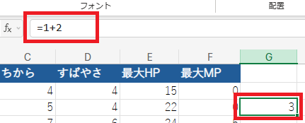

# シート・数式・セル参照

## 1 シート

### 1.1 シートの追加と削除

シートはブックの構成要素です。通常は、ひとつのシートには、ひとつの表を書きます。しかし、ひとつのシートに複数の表を書くこともできます。

ブックを作成すると、シートがひとつ自動的に作成されます。新しいシートを追加するには、画面下にあるシートタブの右端の`＋`ボタンをクリックします。

シートを削除するには、シート名を右クリックして「シートメニュー」を開き、「削除」を選びます。

<pre class="tnmai_assignment">
<strong>【課題１】</strong>
<code＋</code>ボタンをクリックして、新しいシートをひとつ追加しなさい。
</pre>

### 1.2 シート名の変更

作成されたシートには、`Sheet1`や`Sheet2`のような名前が自動的につけられます。この名前ではシートを選ぶときに分かりにくいので、名前を変えましょう。

シートの名前(シート名)を変えるには、シートタブで「名前を変えたいシート名をダブルクリック」します。

<pre class="tnmai_assignment">
<strong>【課題２】</strong>
<code>Sheet1</code>をダブルクリックして、名前を「魔法」に変更しなさい。
次に、<code>Sheet2</code>をダブルクリックして、名前を「成長」に変更しなさい。
</pre>

## 2 入力を補助する機能

### 2.1 オートフィル

２枚目のシートには、レベルごとの経験値、ステータスを書いてもらいます。

<pre class="tnmai_assignment">
<strong>【課題３】</strong>
「成長」シートのA1セルからF1セルに、以下の６個の見出しを入力しなさい。
背景色とフォントの色、太さを変更して、見出しを目立たせること。
  A1: レベル
  B1: 経験値
  C1: ちから
  D1: すばやさ
  E1: 最大HP
  F1: 最大MP
</pre>

さて、表を作るには多数のデータを入力しなくてはなりませんが、これは大変な作業です。そこで、Excelにはデータ入力を楽にするための機能があります。

今回は「オート・フィル(自動穴埋め)」という機能を説明します。次の手順で、オートフィルを実験してください。

>1. レベルの見出しの下にあるA2セルに、数値`1`を入力してください。
>2. 次に、マウスポインタを、A2セルの右下の黒い点に移動します。すると、形状が「黒い十字」に変化します。
>3. そこから、マウスを下方向にドラッグしてください。すると、ドラッグした範囲に数値`1`がコピーされるはずです。これが「オートフィル」です。
>4. `Ctrl`キーを押しながら`Z`キーを押してください。これは「元に戻す」操作です。オートフィルが取り消されたらO.K.です。

オートフィルにはもう少し便利な能力があります。今度は次のように操作してください。

>1. A3セル(数値`1`を入力したセルの下)に、数値`2`を入力してください。
>2. 次に、マウスポインタをA2セルの中央に移動し、そこから下にドラッグして、A2セルとA3セルの両方が選択された状態にします。
>3. マウスポインタをA3セルの右下の黒い点に移動してください。すると、形状が「黒い十字」に変化します。
>4. そこから、マウスを下方向のA31セルまでドラッグしてください。すると、ドラッグした範囲に数値`3`, `4`, `5`, ...と、ひとつずつ増えた数値が書き込まれます。A31は数値`30`になるはずです。

これが、オートフィルの能力です。選択範囲の数値の違いを自動的に認識して、その違いをドラッグした範囲に反映してくれるのです。この例の場合は、「下のセルは、上のセルに`1`足した値」ということを認識して、ドラッグした範囲に反映しているわけです。

このように便利なオートフィルですが、その認識能力は基本的に「数値の変化」に限られます。とりあえずオートフィルを試してみて、上手くいきそうならそのまま、そうでなければ`Ctrl+Z`でもとに戻して手動で書く、という対応がよいでしょう。

### 2.2 見出しを固定する

ドラッグして画面をスクロールさせると、見出しが画面上に消えて見えなくなります。次の手順で、見出しを常に表示することができます。

1. 常に表示したい行の下のセルをクリックし、アクティブセルにします。今回の例では、B2セルをクリックしてください。
2. 「表示」タブをクリックし、左端にある「ウィンドウ枠の固定」ボタンをクリックします。
3. 固定方法のリストが表示されるので、「ウィンドウ枠の固定」をクリックします。

これで、B2セルの上にある見出し行と、B2セルの左にあるレベル列が固定され、常に表示される状態になります。ワークシートをスクロールさせて、見出しとレベルが常に表示されることを確認してください。

ウィンドウ枠の固定を解除するには、「表示」タブの「ウィンドウ枠の固定」をクリックします。ウィンドウ枠が固定されている場合、リストに「ウィンドウ枠固定の解除」が出現します。この項目をクリックすると、固定が解除されます。

### 2.3 数字にカンマを入れる

数値の桁数が増えると、正しい数値を入力することが難しくなります。そこで、Excelには桁数の多い数値を見やすくするために、「桁区切り記号」を表示する機能があります。

「ホーム」タブをクリックして、「数値」グループを見つけます。見つけたら、「数値」グループにある`，`(カンマ)ボタンをクリックします。すると、三桁ごとにカンマが表示されます。

<pre class="tnmai_assignment">
<strong>【課題４】</strong>
「日本の家庭用ゲーム機で初めて発売されたコマンド式RPG」の成長データをインターネットで検索し、
レベルごとの経験値、ちから、すばやさ、最大HP、最大MPを表に記入しなさい。
経験値のセルには「カンマ区切り」を設定して、見やすくすること。

注意点:
  移植版のデータは使わないこと。
  掲載されているデータが正しいとは限りません。複数のサイトを比較して正しさを確認すること。
  データにも著作権があります。取得したデータは講義内でのみ使用し、外部に公開しないこと。
</pre>

## 3 数式とセル参照

### 3.1 数式

Excelは「表計算」ソフトなので、計算機能も持っています。計算機能を使うには、セルに`=`(イコール)で始まる数式を書きます。

G3セルに`=1+2`と入力して、`Enter`キーを押してください。すると、`3`が表示されると思います。次に、G3セルをクリックして、アクティブセルにしてください。このとき上部の数式バーを見ると、実際に入力した数式が表示されます。

Excelの数式に使える記号は、数学とは少し違っています。以下に、数学記号とExcelの記号の対応表を示します。

| 計算 | 数学記号 | Excelの記号(読み) |
|:----:|:-------:|:------------|
| 加算 | + | + (プラス) |
| 減算 | - | - (マイナス) |
| 乗算 | × | * (アスタリスク) |
| 除算 | ÷ | / (スラッシュ) |

数式バーをクリックして数式を変更すると、即座にアクティブセルに反映されます。また、セルをダブルクリックして「編集」モードにすることでも、数式を編集できます。

<pre class="tnmai_assignment">
<strong>【課題５】</strong>
G3セルをダブルクリックして、数式を<code>=5+4*3-2/1</code>に変更しなさい。
G3セルの内容は<code>15</code>になるはずです。
</pre>

### 3.2 セル参照

数式を書くときに、数値の代わりに「セルの名前」を指定できます。この機能を「セル参照」といいます。

G3セルに`=B3-B2`と入力してください。入力中、指定されたセルが強調表示されるのが分かると思います。B3セルの値は`7`、B2セルの値は`0`なので、G3セルは`7 - 0`となって、数値`7`が表示されるはずです。この数値は「レベルアップに必要な経験値」です。

それから、数式にもオートフィルが利用できます。まず、G3セルをクリックしてアクティブセルにしてください。次に、マウスポインタをG3セルの右下の黒点に移動して、形状を「黒い十字」にします。マウスをドラッグして、G31セルまでオートフィルを実行してください。

オートフィルは、セル参照も情報として認識します。ここでは「B列の１個上のセルと引き算している」ことを認識して、選択された全てのセルに、同じような数式を作成してくれたわけです。

<pre class="tnmai_assignment">
<strong>【課題６】</strong>
G1セルに「必要経験値」というテキストを入力し、背景やフォントを他の見出しと合わせなさい。
G2セルに数値<code>0</code>を入力しなさい。
</pre>

<pre class="tnmai_assignment">
<strong>【課題７】</strong>
H1セルに「ちから上昇量」というテキストを入力し、背景やフォントを他の見出しと合わせなさい。
H2セルに数値<code>0</code>を入力しなさい。
H3セルに数式<code>=C3-C2</code>を入力し、オートフィルを使ってH31セルまで同様の数式で埋めなさい。
</pre>

<pre class="tnmai_assignment">
<strong>【課題８】</strong>
課題７を参考に、I1セルからK1セルに以下の見出しを入力しなさい。
次に、I2～K31セルに、対応する差分を計算して表示しなさい。
  I1: すばやさ上昇量
  J1: 最大HP上昇量
  K1: 最大MP上昇量
</pre>
