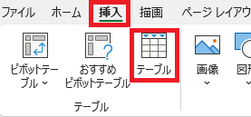
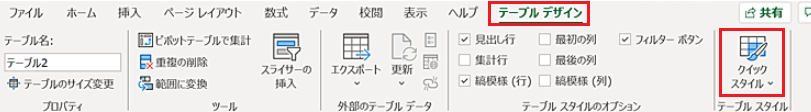
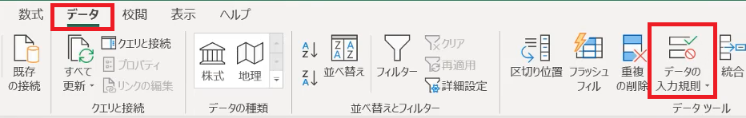
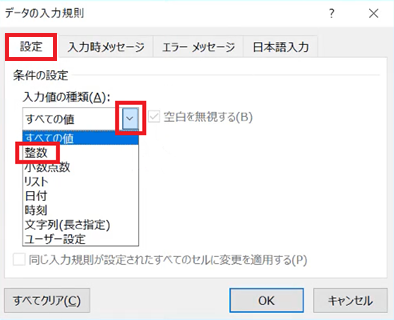
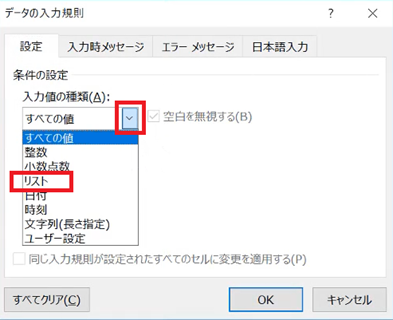
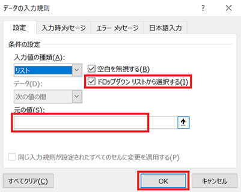

# 入力規則・テーブル

## 1 テーブル

### 1.1 アイテム表を追加する

RPGに登場するアイテムには、武器、防具、道具などがあります。これらをひとつの表にまとめるか、個別の表に分けるかは、アイテム数やゲーム内容によって異なります。

初期のRPGなどはアイテム数も少なく、アイテムごとのデータもわずかです。こういった場合は、ひとつの表にまとめたほうが管理しやすいでしょう。

<pre class="tnmai_assignment">
<strong>【課題１】</strong>
シートを追加して、追加したシートの名前を「アイテム」に変更しなさい。
</pre>

<pre class="tnmai_assignment">
<strong>【課題２】</strong>
「アイテム」シートのA1からF1セルに、次の見出しを入力しなさい。
  A1: 名前
  B1: 価格
  C1: 種類
  D1: 攻撃力
  E1: 守備力
  F1: 効果
</pre>

<pre class="tnmai_assignment">
<strong>【課題３】</strong>
「日本の家庭用ゲーム機で初めて発売されたコマンド式RPG」の「武器」データをインターネットで検索し、
名前、価格、攻撃力を表に入力しなさい。種類、守備力、効果は空欄のままにすること。
</pre>

<pre class="tnmai_assignment">
<strong>【課題４】</strong>
「日本の家庭用ゲーム機で初めて発売されたコマンド式RPG」の「鎧」と「盾」のデータをインターネットで検索し、
名前、価格、守備力を表に入力しなさい。種類、攻撃力、効果は空欄のままにすること。
</pre>

### 1.2 表をテーブルにする

表を作るたびに見出しや枠線などを設定するのは、意外と面倒な作業です。実はExcelには、面倒な設定を一括でやってくれる「テーブル」という機能があります。

1. テーブルにしたい表の中のセル(例えばB2セル)をクリックして、アクティブセルにする
2. 「挿入」タブから「テーブル」というボタンをクリック
3. 作成の確認が表示されるので、「OK」ボタンをクリック

これだけで、それなりに見栄えのする表のできあがりです。

テーブル化された表のセル(どれでもよい)をアクティブセルにすると、上部のタブに「テーブルデザイン」というタブが追加されます。このタブをクリックすると、テーブルのデザインを自由に変更できます。

>テーブルの作成には、「ホーム」タブの「テーブルとして書式設定」を使う方法もあります。

<pre class="tnmai_assignment">
<strong>【課題５】</strong>
魔法シートと成長シートの表をテーブルにしなさい。
</pre>

### 1.3 テーブルの機能

表をテーブルにすると、以下の機能が働くようになります。

* 見出しの固定
* 見出しにフィルター機能が付く
* 列や行を追加、または削除したとき、自動的に書式が反映される(見出しの書式設定が不要)
* テーブルの右下にある`┛`型の「サイズ変更ハンドル」を使って、サイズを自由に変えられる。
* 表の最下段に「集計」行を設定できる(今回は使いません)

特に便利なのは「フィルター機能」です。見出しの右側に増えた`v`ボタンをクリックすると、「並べ替え」や「特定の種類だけを表示」といった操作が簡単に設定できます。

見出し「価格」の右にある`v`ボタンをクリックして、「小さい順に並べ替え」を実行してください。すると、表が価格の安い順に並べ替えられます。

>フィルター機能は、テーブルを使わない場合でも手動で設定できます。

### 1.4 ショートカットキー

並べ替えを「元に戻す」には、`Ctrl`キーを押しながら`Z`キーを押します(以後は`Ctrl+Z`と表記します)。1回押すごとにひとつの操作が取り消されます。Excelの場合、元に戻せる回数は100回までとなっています。

このような、`Ctrl`(コントロール)キーを使った操作を「ショートカット・キー」といいます。以下の表に代表的なショートカットキーを示します。

| キー | 操作 |
|:----:|:----|
| Ctrl+Z | 元に戻す |
| Ctrl+X | 切り取り |
| Ctrl+C | コピー |
| Ctrl+V | 貼り付け |
| Ctrl+S | ファイルの保存 |
| Ctrl+Y | やりなおし |

これらの基本的なショートカットキーは、Excel以外にも多くのアプリで同じように使えます。覚えておくと役に立つでしょう。

<pre class="tnmai_assignment">
<strong>【課題６】</strong>
キーボードの<code>Ctrl+Z</code>を押して、並べ替えを取り消しなさい。
</pre>

### 1.5 通し番号を付ける

Excelの「並べ替え」は実際に表の内容を入れ替えてしまいます。`Ctrl+Z`以外の方法では元に戻せません。例えば、「並べ替えたあとで表にデータを追加し、元の並び順に戻す」ということができません。

この問題への対策として「事前に番号を振っておく」という方法があります。次の手順にしたがって、番号の列を追加してください。

1. A1セルを右クリックして、左側に列を挿入
2. 追加されたA1セルの見出しを「番号」に変更
3. A2セルに数値`1`、A3セルに数値`2`を入力
4. A2セルとA3セルを範囲選択し、A32セルまでオートフォルを実行

あとは、番号列を使って「小さい順に並べ替え」を実行すれば、いつでも元の並び順に戻せます。

<pre class="tnmai_assignment">
<strong>【課題７】</strong>
魔法シートの表に、番号列を追加しなさい(成長表はレベルが使えるので不要)。
</pre>

## 2 入力規則

### 2.1 入力規則(整数)

価格や攻撃力、守備力といった、数値を入力するべきセルに、誤って数字ではない文字(例えば全角の数字)を入力してしまう、ということがあるかもしれません。

このような入力ミスを防ぐには、「入力規則」という機能を使います。入力規則を使うと、「整数のみ」、「文字のみ」、「リストにある単語のみ」といった制約を実現できます。

まず、入力規則を設定したいセルを選択状態にします。とりあえず「価格」を設定したいので、B2セルをクリックしてアクティブセルにしてください。

次に、「データ」タブをクリックし、リボンにある「データの入力規則」をクリックします。

すると、入力規則の設定画面が表示されます。ここで「入力値の種類」の右下の`v`ボタンをクリックすると、選択可能な種類が表示されます。ここでは「整数」をクリックしてください。

すると、整数の設定画面に変化します。「最小値」に`0`、「最大値」に`65535`を入力して、「OK」ボタンをクリックしてください。これでB2セルに入力規則が設定されました。

試しにB2セルに`-1`を入力してみてください。エラーメッセージが表示され、やり直しさせられると思います。

<pre class="tnmai_assignment">
<strong>【課題８】</strong>
B列の、価格が設定されている全てのセルを選択範囲にして、整数の入力規則を設定しなさい。
</pre>

### 2.2 入力規則(リスト)

「種類」の列にはアイテムの種類、例えば「武器」「鎧」「盾」といった単語を入力します。ここでも、変換ミスで間違った単語が入ってしまう可能性があります。

「入力規則」の「リスト」を使うと、有効な単語しか入力できないように設定できます。

まず、入力規則を設定したいセルを選択状態にします。今回の場合、種類の列に設定したいので、C2セルをクリックしてアクティブセルにしてください。

次に、「データ」タブをクリックし、リボンにある「データの入力規則」をクリックします。入力規則の設定画面が表示されるので、「入力値の種類」をクリックして「リスト」を選んでください。

すると、次のようなリストの設定が表示されます。

最初に「ドロップダウンリストから選択する」のチェックボックスをクリックしてチェックを入れます(すでにチェックされている場合は何もしません)。これで、セルに単語選択ボタンが追加されます。

続いて「元の値」の欄に、`武器,鎧,盾,道具`と入力します。単語の区切り記号は`,`(半角カンマ)です。ここで設定した単語が、単語選択リストに表示されます。

入力できたら「OK」ボタンをクリックして、設定を反映してください。うまく設定できていれば、C2セルの右に`v`ボタンが追加されます。

この`v`ボタンをクリックすると、さきほど「元の値」に入力した単語のリストが表示されます。リストから「武器」をクリックして(2行目は武器データのはず)ください。

<pre class="tnmai_assignment">
<strong>【課題９】</strong>
オートフィルを使って、C2セルの内容をC18セルまでコピーしなさい。オートフィルは、値だけでなく、入力規則などもコピーしてくれます。
コピーしたら、C3からC18セルについて、各行のアイテムに対応する単語を選択しなさい。
</pre>

<pre class="tnmai_assignment">
<strong>【課題１０】</strong>
道具のデータをWeb検索して、盾のデータの下に追加しなさい。
</pre>
