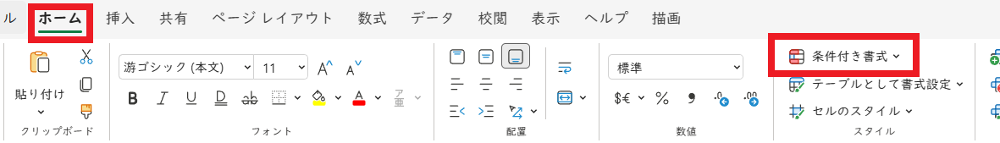
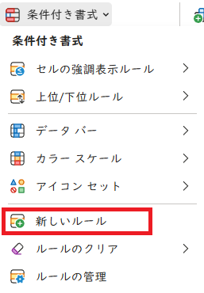
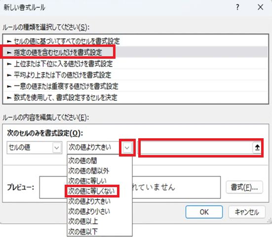
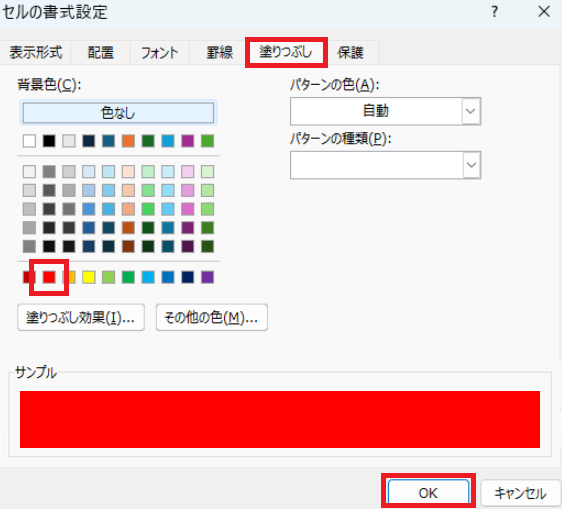
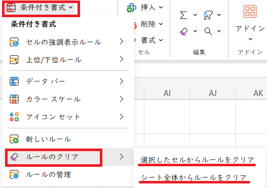
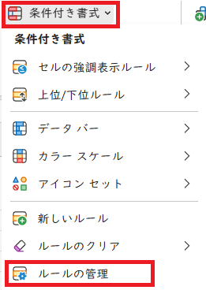
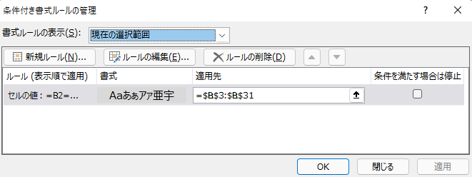

# 条件付き書式

## 1 条件付き書式

### 1.1 条件付き書式の種類

「入力規則」を使うことで、数字と文字を間違えたり、単語を間違える可能性を減らすことができます。

しかし、「入力規則」では防げない間違いもあります。例えば、「武器」の攻撃力を設定するつもりで「守備力」を設定してしまったり、成長データを間違えてレベルアップすると弱くなるように設定してしまう、という間違いは防げません。

この種の間違いを防ぐには、「条件付き書式」という機能を使います。「条件付き書式」を使うと、特定の条件、例えば「種類が武器なのに、攻撃力の数値が入力されていない」といった場合に、セルのフォントや色を変更できます。

条件付き書式は、「ホーム」タブの「条件付き書式」ボタンから設定できます。

条件付き書式には、以下の５種類があります。

1. セルの強調表示ルール: 設定されたルールに該当する場合に、指定されたセルに書式を反映します。
2. 上位/下位ルール: 範囲内のセルについて、上位10%、平均以下などの条件を満たす場合に、書式を反映します。
3. データ バー: 範囲内のセルについて、数値の大きさに<ruby>基<rt>もと</rt></ruby>づいて、棒グラフを表示します。
4. カラー スケール: 範囲内のセルについて、数値の大きさに<ruby>基<rt>もと</rt></ruby>づいて、色を付けます。
5. アイコン セット: 範囲内のセルについて、数値の大きさに<ruby>基<rt>もと</rt></ruby>づいて、アイコンを表示します。
6. 数式: 「新しいルール」から設定します。数式を使うことで、より高度なルールを設定できます。

これらのうち、1と6は主に単独のセルに使います。2～5は複数のセルを対象としていて、主にデータ分析で使われます。

### 1.2 新しいルール

「新しいルール」を使うと、条件付き書式を細かく設定できます。例として、「成長」シートの「レベル1の経験値」を考えます。

レベル1の経験値は、常に`0`であるべきです。そこで、もし`0`以外が入力されたら分かるようにしたいです。以下の操作で、「新しい書式ルール」の設定ウィンドウを開いてください。

1. 「成長」シートを選択
2. B2セルをアクティブセルにする
3. 「ホーム」タブ、「条件付き書式」の順にクリック
4. 「新しいルール」をクリック

「新しい書式ルール」ウィンドウが開いたら、次の手順で「`0`以外」を判定するルールを作成してください。

1. 「指定の値を含むセルだけを書式設定」を選択
2. 「次のセルのみを書式設定」欄に、左から「セルの値」、「次の値に等しくない」を選択し、右の空欄には`0`を入力

続いて、ルールと一致した場合に反映する「書式」を決めます。次の手順にしたがって、背景色を設定してください(好みに応じて、他の設定を行っても構いません)。

1. 右下の「書式」ボタンをクリックして、「セルの書式設定」を開く
2. 「塗りつぶし」タブをクリック
3. 「背景色」から赤色(または他の目立つ色)をクリック
4. 「OK」をクリック

これで、ルールと書式を設定できました。「新しい書式ルール」画面の「OK」ボタンをクリックすると、このルールがアクティブセルに設定されます。

<pre class="tnmai_assignment">
<strong>【課題１】</strong>
B2セルに<code>0</code>以外の数値を入力して、書式が変化することを確かめなさい。
変化することが確認できたら、数値を<code>0</code>に戻しておくこと。
</pre>

### 1.3 セル参照を使うルール

レベル2以上の経験値は、ひとつ前のレベルの経験値より大きくなっていなければなりません。ということは、ひとつ前のレベルの経験値以下の場合は、入力ミスだと考えられます。

次の手順にしたがって、B3セルに「ひとつ前のレベルの経験値以下の場合、背景色を変える」ルールを作成してください。

1. 「成長」シートのB3～B31セルを範囲選択
2. 「ホーム」タブ、「条件付き書式」の順にクリック
3. 「新しいルール」をクリック
4. 「指定の値を含むセルだけを書式設定」を選択
5. 「次のセルのみを書式設定」欄に、左から「セルの値」、「次の値以下」を選択し、右の空欄には`=B2`を入力
6. 右下の「書式」ボタンをクリックして、「セルの書式設定」を開く
7. 「塗りつぶし」タブをクリック
8. 「背景色」から赤色(または他の目立つ色)をクリック
9. 「OK」をクリック

上記のルールでは、B2セルを相対参照にしています。相対参照によって、範囲内のセルは「ひとつ上のセル」と比較するようになります。例えば、B4セルのルールは自動的に、B3セルを参照するように調整されます。

このように、「条件付き書式」を使うと、間違った入力を見つけられるようになります。

>条件付き書式は間違いの検出に限らず、さまざまな用途で利用できます。

<pre class="tnmai_assignment">
<strong>【課題２】</strong>
B3、B4、B31セルに「ひとつ上のセルの経験値」を入力して、書式が変化することを確かめなさい。
変化することが確認できたら、数値を元に戻しておくこと(<code>Ctrl+Z</code>を使うと簡単ですが、使いすぎに注意)。
</pre>

<pre class="tnmai_assignment">
<strong>【課題３】</strong>
レベル2～30までの、ちから、すばやさ、最大HP、最大MPのセルについて、「ひとつ上のセルより小さい」というルールを作成しなさい。
書式は背景色を赤色(または他の目立つ色)に設定すること。
</pre>

### 1.4 ルールの削除

ルールを削除するには、「ホーム」タブの「条件付き書式」リストから「ルールのクリア」を選択します。

削除するルールの範囲を、「選択したセル」または「シート全体」から選んで削除します。

>複数のルールがあり、その一部だけを削除したい場合は「ルールの管理」を使います。

### 1.5 ルールの修正

既存のルールを変更したり、修正を加えたりするには「ルールの管理」を選びます。

すると、「条件付き書式ルールの管理」というウィンドウが開きます。この画面では、既存のルールを編集するだけでなく、新しいルールを追加したり、ルールを削除することもできます。

ルールを修正する場合は、修正したいルールをクリックして選択状態にしてから、「ルールの編集」ボタンをクリックします。

<pre class="tnmai_assignment">
<strong>【課題４】</strong>
「アイテム」シートの「攻撃力」列に、以下の条件付き書式を設定しなさい。
  ルールの種類: 「数式を使用して、書式設定するセルを決定」
  ルールの内容: <code>=D2="武器"</code>
  書式: 「罫線」タブから、セルを「赤い外枠」で囲むように設定
</pre>

<pre class="tnmai_assignment">
<strong>【課題５】</strong>
「アイテム」シートの「守備力」列に、以下の条件付き書式を設定しなさい。
  ルールの種類: 「数式を使用して、書式設定するセルを決定」
  ルールの内容: <code>=D2="鎧"</code>
  書式: 「罫線」タブから、セルを「赤い外枠」で囲むように設定
</pre>

<pre class="tnmai_assignment">
<strong>【課題６】</strong>
「アイテム」シートの「守備力」列に、以下の条件付き書式を設定しなさい。
  ルールの種類: 「数式を使用して、書式設定するセルを決定」
  ルールの内容: <code>=D2="盾"</code>
  書式: 「罫線」タブから、セルを「赤い外枠」で囲むように設定
</pre>
