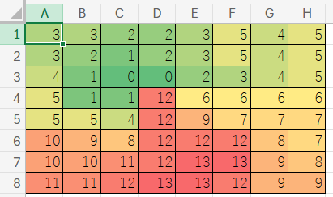

# 条件付き書式

## 1 条件付き書式

### 1.1 条件付き書式の種類

「入力規則」を使うことで、数字と文字を間違えたり、単語を間違える可能性を減らすことができます。

しかし、「入力規則」では防げない間違いもあります。例えば、「武器」の攻撃力を設定するつもりで「守備力」を設定してしまったり、成長データを間違えてレベルアップすると弱くなるように設定してしまう、という間違いは防げません。

この種の間違いを防ぐには、「条件付き書式」という機能を使います。「条件付き書式」を使うと、特定の条件、例えば「種類が武器なのに、攻撃力の数値が入力されていない」といった場合に、セルのフォントや色を変更できます。

また、「範囲内の数値の大きさによってセルを色分けする」といった、データ分析に役立つ使いかたもできます。

条件付き書式は、「ホーム」タブの「条件付き書式」ボタンから設定できます。

条件付き書式には、以下の５種類があります。

1. セルの強調表示ルール: 設定されたルールに該当する場合に、指定されたセルに書式を反映します。
2. 上位/下位ルール: 範囲内のセルについて、上位10%、平均以下などの条件を満たす場合に、書式を反映します。
3. データ バー: 範囲内のセルについて、数値の大きさに<ruby>基<rt>もと</rt></ruby>づいて、棒グラフを表示します。
4. カラー スケール: 範囲内のセルについて、数値の大きさに<ruby>基<rt>もと</rt></ruby>づいて、色を付けます。
5. アイコン セット: 範囲内のセルについて、数値の大きさに<ruby>基<rt>もと</rt></ruby>づいて、アイコンを表示します。
6. 数式: 「新しいルール」から設定します。数式を使うことで、より高度なルールを設定できます。

これらのうち、1と6は「単一のセルの内容」を視覚化します。2～5は「複数のセルの相対的な関係」を視覚化するもので、主にデータ分析で使われます。

本テキストでは、比較的扱いやすい1, 3, 4, 6について解説します。

### 1.2 セルの強調表示ルール

「セルの強調表示ルール」は、選択したルールと一致する場合に、セルの色やフォントを変更する機能です。

例として、道具の価格を考えてみましょう。売却できない道具の場合、価格は`0`に設定されています。そこで、「売却できない価格設定」だと分かるように、価格が`0`のセルだけ色を変えるようにします。

次の手順にしたがって、値が`0`のときにセルを緑色にする条件付き書式を設定してください。

1. 「アイテム」シートを選択
2. 「価格」列のC2:C34セルを範囲選択
3. 「ホーム」タブ、「条件付き書式」の順にクリック
4. 「セルの強調表示ルール」の一覧から、「指定の値に等しい」をクリック
5. 値ボックスに`0`を入力(①)
6. 書式として「濃い緑の文字、明るい緑の背景」を選択(②)
7. OKボタンをクリック(③)

これで、選択範囲内のすべてのセルに「セルの数値が0ならセルの見た目を緑色にする」という条件付き書式が設定されます。条件付き書式を設定した結果、価格が`0`のセルが緑色に変化したら成功です。

ひとつのセルに、複数のルールを設定することも可能です。例として、「魔法」シートの「フィールド」列と「戦闘」列のセルに、「セルの値が`o`なら緑、`x`なら赤くする」という条件付き書式を設定してみましょう。

次の手順にしたがって、「セルの値が`o`なら緑にする」の条件付き書式を設定してください。

1. 「魔法」シートを選択
2. 「フィールド」列と「戦闘」列のセルを範囲選択
3. 「ホーム」タブ、「条件付き書式」の順にクリック
4. 「セルの強調表示ルール」の一覧から、「指定の値に等しい」をクリック
5. 値ボックスに`o`(小文字のオー)を入力
6. 書式として「濃い緑の文字、明るい緑の背景」を選択
7. OKボタンをクリック

<pre class="tnmai_assignment">
<strong>【課題１】</strong>
上記の手順を参考に、「フィールド」列と「戦闘」列のセルに、「セルの値が<code>x</code>なら赤くする」条件付き書式を設定しなさい。
</pre>

### 1.3 データ バー

「データ バー」は、セルに横棒グラフを表示する機能です。棒の長さは、0と選択範囲内の最大値に対する比率になります。

例えば、範囲内のセルの最大値が40のとき、そのセルの棒の長さは最大になります。そして、範囲内にある、とあるセルの値が20の場合、20のセルに表示される棒の長さは、40のセルの半分になります。

もういちど、道具の価格を考えてみましょう。棒グラフを使うと価格の高低を視覚的に識別できるでしょう。次の手順にしたがって、価格にデータバーを設定してください。

1. 「アイテム」シートを選択
2. 「価格」列のC2:C34セルを範囲選択
3. 「ホーム」タブ、「条件付き書式」の順にクリック
4. 「データ バー」の一覧から、「単色の黄色(またはオレンジ)」のデータバーをクリック

うまく設定できていれば、選択範囲内のすべてのセルに「セルの数値に対応する棒グラフ」が表示されるはずです。

>**【グラデーションを使ってはいけない】** 
>グラフにグラデーションをかけると、グラフを正しく読み取ることが難しくなります。グラフは単色で描くようにしましょう。

<pre class="tnmai_assignment">
<strong>【課題２】</strong>
上記の手順を参考に、「成長」シートの以下の列に、データバーの条件付き書式を設定しなさい。
  ・ちから上昇量
  ・すばやさ上昇量
  ・最大HP上昇量
  ・最大MP上昇量
</pre>

### 1.4 カラースケール

「カラースケール」は、範囲内の数字の大きさに応じて異なる色を付ける機能です。色分けすることで、数値の分布がわかりやすくなります。

例として「遭遇マップ」を色付けしてみましょう。現在の遭遇マップには見出しも何もなく、ただ数値が並んでいるだけなので、あまり見やすい表とは言えないからです。

地上マップに関するかぎり、遭遇表の番号は敵のおよその強さを反映しています。つまり、番号1には最弱の敵がリストされ、番号14には地上では最強レベルの敵がリストされているわけです。

このような表は、色分けによる分析対象として有望です。それでは、次の手順にしたがって、カラースケールの条件付き書式を設定してください。

1. 「遭遇マップ」シートを選択
2. A1:H8セルを範囲選択
3. 「ホーム」タブ、「条件付き書式」の順にクリック
4. 「カラー スケール」の一覧から、赤、黄、緑のカラースケールをクリック

遭遇マップが次のように色分けされていれば成功です。この色分けでは、弱い敵がいる地域ほど緑が濃く、強い敵がいる地域ほど赤が濃く表示されます(色合いはExcelのバージョンによって多少異なります)。

>**【カラースケールとデータバーはどちらを使うべきか】** 
>カラースケールは、遭遇マップのような２次元の表や、気温や湿度のような、色から数値がイメージしやすい用途で使うと効果的です。それ以外の「相対的な数値の大小」を視覚化する用途では、データバーのほうが見やすくなります。

### 1.5 新しいルール

「新しいルール」を使うと、条件付き書式を細かく設定できます。例として、「成長」シートの「レベル1の経験値」を考えます。

レベル1の経験値は、常に`0`であるべきです。そこで、もし`0`以外が入力されたら分かるようにしたいです。以下の操作で、「新しい書式ルール」の設定ウィンドウを開いてください。

1. 「成長」シートを選択
2. B2セルをアクティブセルにする
3. 「ホーム」タブ、「条件付き書式」の順にクリック
4. 「新しいルール」をクリック

「新しい書式ルール」ウィンドウが開いたら、次の手順で「`0`以外」を判定するルールを作成してください。

1. 「指定の値を含むセルだけを書式設定」を選択
2. 「次のセルのみを書式設定」欄に、左から「セルの値」、「次の値に等しくない」を選択し、右の空欄には`0`を入力

続いて、ルールと一致した場合に反映する「書式」を決めます。次の手順にしたがって、背景色を設定してください(好みに応じて、他の設定を行っても構いません)。

1. 右下の「書式」ボタンをクリックして、「セルの書式設定」を開く
2. 「塗りつぶし」タブをクリック
3. 「背景色」から赤色(または他の目立つ色)をクリック
4. 「OK」をクリック

これで、ルールと書式を設定できました。「新しい書式ルール」画面の「OK」ボタンをクリックすると、このルールがアクティブセルに設定されます。

<pre class="tnmai_assignment">
<strong>【課題３】</strong>
B2セルに<code>0</code>以外の数値を入力して、書式が変化することを確かめなさい。
変化することが確認できたら、数値を<code>0</code>に戻しておくこと。
</pre>

### 1.6 セル参照を使うルール

レベル2以上の経験値は、ひとつ前のレベルの経験値より大きくなっていなければなりません。ということは、ひとつ前のレベルの経験値以下の場合は、入力ミスだと考えられます。

次の手順にしたがって、B3セルに「ひとつ前のレベルの経験値以下の場合、背景色を変える」ルールを作成してください。

1. 「成長」シートのB3～B31セルを範囲選択
2. 「ホーム」タブ、「条件付き書式」の順にクリック
3. 「新しいルール」をクリック
4. 「指定の値を含むセルだけを書式設定」を選択
5. 「次のセルのみを書式設定」欄に、左から「セルの値」、「次の値以下」を選択し、右の空欄には`=B2`を入力
6. 右下の「書式」ボタンをクリックして、「セルの書式設定」を開く
7. 「塗りつぶし」タブをクリック
8. 「背景色」から赤色(または他の目立つ色)をクリック
9. 「OK」をクリック

上記のルールでは、B2セルを相対参照にしています。相対参照によって、範囲内のセルは「ひとつ上のセル」と比較するようになります。例えば、B4セルのルールは自動的に、B3セルを参照するように調整されます。

このように、「条件付き書式」を使うと、間違った入力を見つけられるようになります。

>条件付き書式は間違いの検出に限らず、さまざまな用途で利用できます。

<pre class="tnmai_assignment">
<strong>【課題４】</strong>
B3、B4、B31セルに「ひとつ上のセルの経験値」を入力して、書式が変化することを確かめなさい。
変化することが確認できたら、数値を元に戻しておくこと(<code>Ctrl+Z</code>を使うと簡単ですが、使いすぎに注意)。
</pre>

<pre class="tnmai_assignment">
<strong>【課題５】</strong>
レベル2～30までの、ちから、すばやさ、最大HP、最大MPのセルについて、「ひとつ上のセルより小さい」というルールを作成しなさい。
書式は背景色を赤色(または他の目立つ色)に設定すること。
</pre>

### 1.7 ルールの削除

ルールを削除するには、「ホーム」タブの「条件付き書式」リストから「ルールのクリア」を選択します。

削除するルールの範囲を、「選択したセル」または「シート全体」から選んで削除します。

### 1.8 ルールの修正

既存のルールを変更したり、修正を加えたり、削除するには「ルールの管理」を選びます。

すると、「条件付き書式ルールの管理」というウィンドウが開きます。この画面では、既存のルールを編集するだけでなく、新しいルールを追加したり、ルールを削除することもできます。

ルールを修正する場合は、修正したいルールをクリックして選択状態にしてから、「ルールの編集」ボタンをクリックします。

<pre class="tnmai_assignment">
<strong>【課題６】</strong>
「アイテム」シートの「攻撃力」列に、以下の条件付き書式を設定しなさい。
  ルールの種類: 「数式を使用して、書式設定するセルを決定」
  ルールの内容: <code>=D2="武器"</code>
  書式: 「罫線」タブから、セルを「赤い外枠」で囲むように設定
</pre>

<pre class="tnmai_assignment">
<strong>【課題７】</strong>
「アイテム」シートの「守備力」列に、以下の条件付き書式を設定しなさい。
  ルールの種類: 「数式を使用して、書式設定するセルを決定」
  ルールの内容: <code>=D2="鎧"</code>
  書式: 「罫線」タブから、セルを「赤い外枠」で囲むように設定
</pre>

<pre class="tnmai_assignment">
<strong>【課題８】</strong>
「アイテム」シートの「守備力」列に、以下の条件付き書式を設定しなさい。
  ルールの種類: 「数式を使用して、書式設定するセルを決定」
  ルールの内容: <code>=D2="盾"</code>
  書式: 「罫線」タブから、セルを「赤い外枠」で囲むように設定
</pre>

<pre class="tnmai_assignment">
<strong>【課題９】</strong>
「モンスターデータ」シートのC1～G1セルに、以下の見出しを入力しなさい
  C1: 攻撃力
  D1: 守備力
  E1: HP
  F1: 経験値
  G1: ゴールド

上記以外のデータは入力しなくて構いません。
</pre>

<pre class="tnmai_assignment">
<strong>【課題１０】</strong>
「攻撃力」、「守備力」、「HP」、「経験値」、「ゴールド」列に、「整数」の入力規則を設定しなさい。
行の範囲は「名前」列に合わせること。
最小値は<code>0</code>、最大値は<code>255</code>とすること。
</pre>

<pre class="tnmai_assignment">
<strong>【課題１１】</strong>
「日本の家庭用ゲーム機で初めて発売されたコマンド式RPG」について、課題９で入力したモンスターのデータをインターネットで検索し、対応する列に入力しなさい。
</pre>

<pre class="tnmai_assignment">
<strong>【課題１２】</strong>
「モンスターデータ」シートの以下の列に、データバーの条件付き書式を設定しなさい。
  ・攻撃力
  ・守備力
  ・HP
  ・経験値
  ・ゴールド
</pre>
