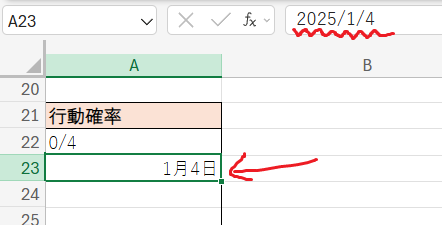
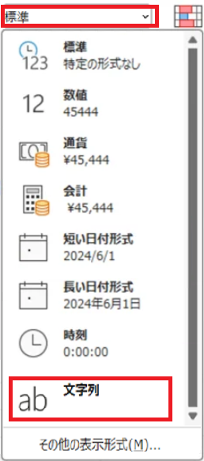

# 参照用シート

## 1 参照用シートの作成

### 1.1 参照用のシートを作成する

「入力規則」のリストに単語を設定すると、設定した単語だけしか入力できなくなります。このとき、直接単語を設定する以外にも、セル範囲を指定することもできるのでした。

実際に、「店」シートの商品情報は、「アイテム」シートの名前列を参照して作成しました。このような、「別の表をリスト要素にする」というのは、Excelではよく使われる手法です。

例えば、ゲームにおいてモンスターの行動パターンを設定することを考えます。パターンは、攻撃、仲間を呼ぶ、回復魔法、補助魔法、スキル、といった行動を確率で組み合わせて作成することとします。

>ゲームによりますが、RPGのモンスターなどの敵は、意外と多くのデータを持っています。

それぞれの行動の詳細を、実際にそれらの行動を作成するプログラマーに伝えるには、行動の詳細を表にまとめておくと便利です。これを、「モンスターの行動表」とします。そして、「モンスターデータ」の「行動パターン」列には、リスト入力規則を使って「モンスター行動表」の「名前」列を指定します。

また、モンスターの行動がひとつの表にまとめきれない場合は、同じシートに複数の表を作ります。このような、「他の表から参照されることを目的としたシート」、つまり「参照用シート」を作ると、ゲームの仕様を管理しやすく保つことができます。

とりあえず、参照用のシートを作成しましょう。次の手順にしたがって、新しいシートを作成してください。

1. 新しいシートを追加
2. 追加したシートの名前を「モンスターの行動」に変更

さて、とあるRPGのモンスターは、通常攻撃に加えて「補助魔法」「攻撃魔法」「特殊攻撃」という選択肢を持っています。このうち「攻撃魔法と特殊攻撃は同じグループで、「攻撃魔法を使う敵は特殊攻撃をしない、特殊攻撃を使う敵は攻撃魔法を使わない」というシステムになっています。

そこで、攻撃魔法と特殊攻撃は同じ行動グループにまとめます。次の手順にしたがって、２つのモンスターの行動パターン表を作成してください。

1. 「モンスターの行動」シートを選択。
2. A1セルに「補助魔法」、 B1セルに「説明」という見出しを入力
3. A2セルに<code>-</code>(マイナス)記号、B2セルに「行動なし」と入力
4. A11セルに「攻撃魔法・特殊攻撃」、 B11セルに「説明」という見出しを入力
5. A12セルに<code>-</code>(マイナス)記号、B12セルに「行動なし」と入力

「攻撃魔法・特殊攻撃」の位置をA11としたのは、データを追加する余裕を持てること、複数の参照表を作る場合に位置を覚えやすいこと、の２つの理由があります。

<pre class="tnmai_assignment">
<strong>【課題１】</strong>
「日本の家庭用ゲーム機で初めて発売されたコマンド式RPG」では、モンスターの行動は「物理攻撃」、「逃走」、「補助魔法」、「攻撃魔法・特殊攻撃」に分けられます。
モンスターデータとして設定できるのは「補助魔法」と「攻撃魔法・特殊攻撃」の２種類で、それぞれ４パターン(「行動なし」を含めると５パターン)から選択します。

「日本の家庭用ゲーム機で初めて発売されたコマンド式RPG」について、モンスターが使う補助魔法のリストをインターネットで検索し、名前と説明を「補助魔法」表に入力しなさい。
「補助魔法」の４パターンを入力したら、次は「攻撃魔法・特殊攻撃」のリストをインターネットで検索し、名前と説明を「攻撃魔法・特殊攻撃」表に入力しなさい。

見出しの書式を読みやすく変更し、表を枠線で囲むこと。
</pre>

### 1.3 セルの表示形式を指定する

なんらかの確率を、分数であらわしたい場合があります。例えば、RPGのモンスターの行動は確率によって制御されます。次の手順にしたがって、この確率をあらわす表を追加してください。

1. 「モンスターの行動」シートのA21セルに「行動確率」という見出しを入力
2. A22セルに`0/4`、A23セルに`1/4`と入力

手順2では、`0/4`は入力どおりに表示されますが、`1/4`は「1月4日」に変わってしまいます。A23セルをクリックして数式バーを見ると、「2025/1/4」と入力したことになっています。

分数が日付に変わってしまう原因は、セルの「表示形式」が「標準」に設定されているからです。「標準」の表示形式は「入力に合わせて、自動的に適切な表示形式に変換」する表示形式です。ほとんどの場合、「標準」から変える必要はありません。

しかし、今回のように分数を入力したい場合は、手動で表示形式を設定しなくてはなりません。そうしないと、一部の分数が日付に変換されてしまうからです。

表示形式の変更は、「ホーム」タブにある「数値」グループから行います(以前、三桁区切りの設定にも使いました)。

分数を入力したとおりに表示するには、以下の２つの方法があります。

* **表示形式を「文字列」にする** 
  「分数」では標準で用意されていない分母にも対応できる。 
  約分されない。数値として認識されない。
* **表示形式を「分数」にする** 
  自動的に約分され、帯分数として表示される。 
  約分されない表示形式もあるが、指定できる分母に制限がある。

セルに入力したいデータの性質に合わせて、どちらの方法を使うかを決めます。 
ですが、基本的には「文字列」を使います。約分されると数値の大小を比較しにくいからです。

>例えば、約分しない 0/4, 1/4, 2/4, 3/4 は大小関係がすぐ分かります。 
>しかし、約分されて 0, 1/4, 1/2, 1 になると、大小関係を見分けにくいです。

それでは、次の手順にしたがって、「行動確率」表の表示形式を文字列に設定し、0/4～3/4までの分数を入力してください。

1. A22～A25セルを範囲選択。
2. 「ホーム」タブの「数値」グループにある「標準」という部分を「文字列」に変更。
3. A22～A25セルに、分数 0/4, 1/4, 2/4, 3/4 を入力。

### 1.4 モンスターデータに魔法と特殊攻撃のデータを追加する

次に、参照用のシートを利用して、モンスターデータに魔法と特殊攻撃のデータを追加します。まず、次の課題を完了させてください。

<pre class="tnmai_assignment">
<strong>【課題２】</strong>
「モンスターデータ」シートのH1～K1セルに、以下の見出しを入力しなさい。
  H1: 補助魔法
  I1: 補助魔法確率
  J1: 攻撃魔法・特殊攻撃
  K1: 攻撃魔法・特殊攻撃確率
</pre>

続いて、入力規則を設定しましょう。

1. 「モンスターデータ」シートを選択
2. 「補助魔法」列のH2:H41を範囲選択
3. 「データ」タブの「データの入力規則」をクリック
4. リストとして 「モンスターの行動」シートのA2:A6セルを指定

補助魔法確率、攻撃魔法・特殊攻撃、攻撃魔法・特殊攻撃確率の３列にも、同じような入力規則が設定できます。以下の課題を完了させて、入力規則を設定してください。

<pre class="tnmai_assignment">
<strong>【課題３】</strong>
「補助魔法確率」列に、入力規則のリストを設定しなさい。
行の範囲は「名前」列に合わせること。
リストの値には、「モンスターの行動」シートのA22:A25セルを指定すること。
</pre>

<pre class="tnmai_assignment">
<strong>【課題４】</strong>
「攻撃魔法・特殊攻撃」列に、入力規則のリストを設定しなさい。
行の範囲は「名前」列に合わせること。
リストの値には、「モンスターの行動」シートのA12:A16セルを指定すること。
</pre>

<pre class="tnmai_assignment">
<strong>【課題５】</strong>
「攻撃魔法・特殊攻撃」列に、入力規則のリストを設定しなさい。
行の範囲は「名前」列に合わせること。
リストの値には、「モンスターの行動」シートのA12:A16セルを指定すること。
</pre>

<pre class="tnmai_assignment">
<strong>【課題６】</strong>
「日本の家庭用ゲーム機で初めて発売されたコマンド式RPG」について、課題２で入力した４つの
モンスターデータをインターネットで検索し、対応する列に入力しなさい。

なお、多くのモンスターは魔法も特殊攻撃も行いません。オートフィルを使って、全モンスターの行動
パターンと確率を、<code>-</code>(行動なし)と<code>0/4</code>で埋めてから、必要なセルにだけデータを入力すると楽です。
</pre>

### 1.5 回避率の表を設定する

一般的はコマンド式RPGのモンスターは、プレイヤーからのさまざまな攻撃に対して、いくらかの耐性を持っています。ここでいう「耐性」とは、武器による攻撃を回避したり、魔法を無効化したりする能力のことです。

とあるRPGでは、武器攻撃に対する回避率に加えて、魔法の種類ごとに16段階の異なる回避率を指定できるシステムになっています。これによって、「アンデッド系の敵は眠りにくい」のような特徴を表現できます。

まずは参照用の表を作成しましょう。次の２つの課題を完了して、「攻撃回避率」と「魔法回避率」の表を作成してください。

<pre class="tnmai_assignment">
<strong>【課題７】</strong>
攻撃回避率は、 0/64 ～ 15/64 までの16段階になっています(最大で約1/4の確率で攻撃が回避される)。
「モンスターの行動」シートのA31セルに「攻撃回避率」の見出しを入力し、16段階の分数による表を作成しなさい。
</pre>

<pre class="tnmai_assignment">
<strong>【課題８】</strong>
攻撃魔法回避率、睡眠魔法回避率、魔法封じ回避率の３つは、 0/16 ～ 15/16 までの16段階になっています。
「モンスターの行動」シートのA51セルに「魔法回避率」の見出しを入力し、16段階の分数による表を作成しなさい。
</pre>

### 1.6 モンスターデータに回避率を追加する

作成した回避率表を使って、モンスターデータに回避率データを追加しましょう。以下の課題を完了して、モンスターデータを完成させてください。

<pre class="tnmai_assignment">
<strong>【課題９】</strong>
「モンスターデータ」シートのL1～O1セルに、以下の見出しを入力しなさい
  L1: 攻撃回避率
  M1: 攻撃魔法回避率
  N1: 睡眠魔法回避率
  O1: 魔法封じ回避率
</pre>

<pre class="tnmai_assignment">
<strong>【課題１０】</strong>
「モンスターデータ」の「攻撃回避率」列に、攻撃回避率表を使ったリスト入力規則を設定しなさい。
</pre>

<pre class="tnmai_assignment">
<strong>【課題１１】</strong>
「モンスターデータ」の「攻撃魔法回避率」「睡眠魔法回避率」「魔法封じ回避率」の３列に、魔法回避率表を使ったリスト入力規則を設定しなさい。
</pre>

<pre class="tnmai_assignment">
<strong>【課題１２】</strong>
「日本の家庭用ゲーム機で初めて発売されたコマンド式RPG」について、課題１０で入力した４つのモンスターデータをインターネットで検索し、対応する列に入力しなさい。

なお、攻撃回避率の約半分は<code>1/64</code>、攻撃魔法回避率と睡眠魔法回避率の大半は<code>0/16</code>、
魔法封じ回避率の大半は<code>15/16</code>(魔法が使えない敵は耐性が高い設定のため)です。オートフィルを
使って、これらの値を列全体にコピーしてから、必要なセルにだけデータを入力するとよいでしょう。
</pre>

## 2 複数の条件を組み合わせる

### 2.1 行動パターンと確率の列に条件付き書式を設定する

次に、条件付き書式を使って「不適切な値が設定されているセル」を視覚化しましょう。例えば、「不適切な行動パターン」として以下のものが考えられます。

* 確率が0/4なのに、魔法や特殊攻撃が設定されている(`-`以外が設定されている)
* 確率が0/4ではないのに、魔法や特殊攻撃が設定されていない(`-`が設定されている)

これらは、２つの条件を同時に判定する必要があります。例えば「確率が0/4」と「`-`以外」の2つです。このような場合、２つの条件を掛け算します。

例えば、補助魔法の確率はI2セルから始まるので、「確率が0/4」という条件は次の式になります(0/4は文字列なので`"`で囲む)。

&emsp;`I2="0/4"`

そして「`-`以外」という条件は次の式になります(Excelにおいて「以外」は`<>`であらわします)。

&emsp;`H2<>"-"`

また、条件式の結果は、条件が成立する場合は`TRUE`(トゥルー)、不成立の場合は`FALSE`(フォルス)になりますが、これらの値を計算に使うときは以下のように変換されます。

| 条件式の結果 | 計算用に変換された値 |
|:--:|:---:|
| FALSE | 0 |
| TRUE | 1 |

そのため、２つの条件を掛け算すると、両方の条件が成立すれば`1`、それ以外は`0`になる条件が作成できるのです。

このとき、個々の条件はカッコで囲む必要があります。そうしないと、掛け算の`*`が先に実行されてしまうからです。つまり、完成した式は次のようになります。

&emsp;`=(I2="0/4")*(H2<>"-")`

それでは、次の手順にしたがって、条件付き書式を設定してください。

1. 「補助魔法」列のH2:H41を範囲選択
2. 「ホーム」タブの「条件付き書式」にある「新しいルール」をクリック
3. 「数式を使用して、書式設定するセルを決式」を選択
4. ルールの内容に`=(I2="0/4")*(H2<>"-")`と入力
5. 右下の「書式」ボタンをクリックして、「セルの書式設定」を開く
6. 「塗りつぶし」タブをクリック
7. 「背景色」から赤色(または他の目立つ色)をクリック
8. 「OK」をクリック

このように、複数の条件を組み合わせるには掛け算記号`*`を使います。

>他の組み合わせ方もあります。それは、別の回で解説します。

<pre class="tnmai_assignment">
<strong>【課題１３】</strong>
「補助魔法」列に、「確率が0/4ではないのに、<code>-</code>が設定されている」ときの条件付き書式を設定しなさい。
</pre>

<pre class="tnmai_assignment">
<strong>【課題１４】</strong>
「攻撃魔法・特殊攻撃」列に、「補助魔法」列と同様の条件付き書式を設定しなさい(２つ設定することに注意)。
</pre>

<pre class="tnmai_assignment">
<strong>【課題１５】</strong>
「補助魔法確率」列、「補助魔法」列と全く同じ条件付き書式を設定しなさい(２つ設定することに注意)。
</pre>

<pre class="tnmai_assignment">
<strong>【課題１６】</strong>
「攻撃魔法・特殊攻撃確率」列に「攻撃魔法・特殊攻撃」列と全く同じ条件付き書式を設定しなさい(２つ設定することに注意)。
</pre>

### 2.2 アイテムシートに複数条件の条件付き書式を設定する

複数条件を設定する練習として、「アイテム」シートの「攻撃力」列に「種類が武器ではない場合に、攻撃力を設定するとセルの書式が変わる」設定を追加しましょう。次の手順にしたがって、条件付き書式を設定してください。

>空欄をあらわすには、`""`のようにダブルクォーテーション２個を続けて書きます。

1. 「アイテム」シートを選択
2. 「攻撃力」列のE2:E34を範囲選択
3. 「ホーム」タブの「条件付き書式」にある「新しいルール」をクリック
4. 「数式を使用して、書式設定するセルを決式」を選択
5. ルールの内容に`=(D2<>"武器")*(E2<>"")`と入力
6. 右下の「書式」ボタンをクリックして、「セルの書式設定」を開く
7. 「塗りつぶし」タブをクリック
8. 「背景色」から赤色(または他の目立つ色)をクリック
9. 「OK」をクリック

<pre class="tnmai_assignment">
<strong>【課題１６】</strong>
「アイテム」シートの「守備力」列に「種類が鎧ではなく、盾でもない場合に、守備力を設定するとセルの書式が変わる」条件付き書式を設定しなさい。
条件が３つあるので、掛け算を２回使います。
</pre>
