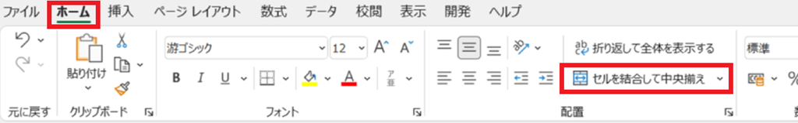
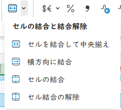

# 関数の使い方(その１)

## 1 合計・平均

### 1.1 関数という便利機能について

数式を使うと「データの見かた」を変えられます。例えば、「レベルごとのステータス表から、ステータス上昇量の表を作る」といった操作が可能です。

しかし、普通の数式だけでは計算できないデータもあります。例えば、「お店で販売している商品の数」は、単純な計算では求められません。また、「B1～B41セルの合計」を数式で求めるには、B2からB41まで40個の足し算を書かなくてはなりません。

このような、「通常の計算では求められないデータ」や「数式であらわすには面倒なデータ」を求めるには、「関数」という機能を使います。

例えば、`SUM`(サム)という関数を使うと、「B2～B41セルの合計」は次のように書くことができます。

`SUM(B1:B41)`

上の例のように、関数を利用するにはまず「関数の名前」を書き、次に丸カッコの中に「操作するセル」または「数値」や「単語」を書きます。

`関数名(操作するセル、または数値や単語)`

Excelには便利な関数がたくさん用意されています。全部を紹介することはできないので、ここではいくつか有用な関数について、実例をあげながら解説していきます。

### 1.2 SUM(サム)

ある範囲の合計を求めるには、`SUM`関数を使います。例として、必要経験値の合計を求めてみましょう。

1. 「成長」シートをクリック
2. 必要経験値の列の一番下のセルの２つ下のセルに「合計」という単語を入力(必要経験値がG列、一番下がG31セルの場合、G33セルに入力する)
3. 「合計」セルの下のセルに`=SUM(必要経験値列の一番上のセル名:一番下のセル名)`という数式を入力(例えば、必要経験値がG列、一番上がG2、一番下がG31セルの場合、`=SUM($G$2:$G$31)`と入力する)

このように、`SUM`関数を使うと簡単に合計を計算できます。

>縦方向の範囲を指定するときは、基本的に「絶対参照」で指定します。 
>相対参照を使うと、並べ替えやフィルターを実行したときに範囲が変わってしまい、正しい計算ができなくなるからです。

### 1.3 AVERAGE(アベレージ)

ある範囲の平均値を求めるには、`AVERAGE`関数を使います。例として、「ちから上昇量」の平均値を求めてみましょう。

1. 「成長」シートをクリック
2. ちから上昇量の列の一番下のセルの２つ下のセルに「平均」という単語を入力(ちから上昇量がH列、一番下がH31セルの場合、H33セルに入力する)
3. 「平均」セルの下のセルに`=AVERAGE(ちから上昇量列の上から二番目のセル名:一番下のセル名)`という数式を入力(例えば、ちから上昇量がH列、上から二番目のセルがH3、一番下がH31セルの場合、`=AVERAGE($H$3:$H$31)`と入力する)

`AVERAGE`関数は「範囲を合計し、セル数で割る」という処理を行います。レベル1の状態は初期値であって「上昇量」ではないので、除外していることに注意してください。

レベル1を含めてしまうとセル数が1つ増えるため、平均値が本来より小さく計算されてしまいます。このように、計算の範囲を適切に選択することは重要です。

<pre class="tnmai_assignment">
<strong>【課題１】</strong>
「すばやさ上昇量」、「最大HP上昇量」、「最大MP上昇量」の３つの列について、
「ちから上昇量」列と同じやり方で、平均値を計算するセルを追加しなさい。
</pre>

### 1.4 セルを結合する

ところで、「平均」とだけ書かれたセルが並んでいると、ちょっと見にくいと感じるかもしれません。このような場合、「セルの結合」を使うことで「ひとつの大きなセル」を作ることが可能です。手順は次のとおりです。

1. ４つの「平均」セルを範囲選択
2. 「ホーム」タブをクリック
3. 「セルを結合して中央揃え」をクリック

結合を解除したいときは、解除したいセルを選択して「セルを結合して中央揃え」の右側にある小さい`v`部分をクリックします。

すると、以下のようなメニューが表示されます。 
このメニューにある「セル結合の解除」をクリックすると、結合が解除されます。

>「セルの結合」には、データの並び替えができなくなったり、範囲選択がやりにくくなる、といったデメリットもあります。使いすぎないようにしましょう。

### 1.5 ROUNDDOWN(ラウンド・ダウン)

なにかを計算をするとき、端数を四捨五入したり、あるいは、切り捨てたり、逆に切り上げたりしたい場合があります。

突然ですが、敵を倒したときに得られる経験値やゴールドは、「敵の強さ」とほぼ一致しているべきでしょう。このことを調べるには「敵の強さ」を求める必要があります。単純な方法として考えられるのは、敵のステータスを合計することです。

ただし、「日本の家庭用ゲーム機で最初に発売されたコマンド式RPG」では、与える/受けるダメージをだいたい $ 攻撃力 - 守備力 \div 2 $ で計算しています。そこで、守備力だけは半分に割って合計することにします。ただし、 $ 守備力 \div 2 $ の部分は「端数切捨て」で計算されます。

そういうわけで、「敵の強さ」は次のような数式で求めることにします。

$ 敵の強さ = 敵の攻撃力 + 端数切捨て(敵の守備力 \div 2) + 敵のHP $

四捨五入、切り捨て、切り上げは、次の関数で実現できます。

| 機能 | 関数 | 書式 |
|:-----|:-----|:-----|
| 四捨五入 | ROUND(ラウンド) | ROUND(数値, 小数点以下の桁数) |
| 切り捨て | ROUNDDOWN(ラウンド・ダウン) | ROUNDDOWN(数値, 小数点以下の桁数) |
| 切り上げ | ROUNDUP(ラウンド・アップ) | ROUNDUP(数値, 小数点以下の桁数) |

それでは、次の手順にしたがって、「敵の強さ」を計算してください。

1. 「敵」シートをクリック
2. P1セルに「強さ」と入力
3. P2セルに数式`=C2 + ROUNDDOWN(D2 / 2, 0) + E2`を入力
4. P2セルの枠の右下にある黒い点(`■`)にカーソルを合わせ、P41セルまでドラッグしてオートフィルを実行

この「敵の強さ」の数式は適当なので、目安でしかありません。より正確な強さを求めるには、「敵の使う魔法」や「攻撃の回避率」なども考慮する必要があるでしょう。

それでも、P列をながめてみると、前後の敵と比べて不自然に「強い」敵がいくつか見つかるでしょう。それらの敵は、単調になりがちな戦闘にアクセントを加えるためだったり、イベント戦闘のために作られた敵だったりするはずです。そして、彼らの経験値やゴールドは、普通の敵とは違う設定になっているでしょう。

>なお、単純に範囲を合計するだけなら、`SUM`関数を使うほうが簡単です。

## 2 セルをかぞえる

### 2.1 COUNT(カウント)

「商品の数」など、「データの数をかぞえる」には、`COUNT`(カウント)系の関数を使います。`COUNT`系の関数には、簡単なバージョンが３つ、ちょっと複雑なバージョンが２つあります。

簡単なバージョン:

* `COUNT`(カウント): 範囲内の数値データ数をかぞえる(文字データは無視される)
* `COUNTA`(カウント・エー): 範囲内の文字データ数をかぞえる(数値データは無視される)
* `COUNTBLANK`(カウント・ブランク): 範囲内の「何も入力されていないセル」の数をかぞえる

ちょっと複雑なバージョン:

* `COUNTIF`(カウント・イフ): 範囲内の「条件に合う」データ数をかぞえる
* `COUNTIFS`(カウント・イフ・エス): 範囲内の「複数の条件に合う」データ数をかぞえる

簡単なバージョンは「決められた何かをかぞえる」ものです。ちょっと複雑なバージョンは「条件」を指定して、その条件に合うデータの数をかぞえます。

「データ数をかぞえる」という操作は、単にデータの数を知りたいときだけでなく、データが過不足なく入力されていることを調べる用途にも使えます。

例えば、敵の表の一部、例えば「攻撃力」列に、データが入力されていないセルがあったとしましょう。この場合、`COUNTBLANK`関数を使えば、入力されていないセルを見つけることができます。すべてのセルにデータが入力されていれば、`COUNTBLANK`関数の結果は`0`になるからです。以下の手順で`COUNTBLANK`関数の動作を確認してください。

1. 「成長」シートをクリック
2. 「攻撃力」列の一番下のセルの２つ下のセルに「未入力」という単語を入力
3. 「未入力」セルの下のセルに`=COUNTBLANK(攻撃力列の上から二番目のセル名:一番下のセル名)`という数式を入力(セル名は「絶対参照」で指定すること)

数式を入力したセルに`0`と表示されたら、空白、つまり未入力のセルはありません。これで、少なくとも「入力していない」というミスはなかったことが分かります(間違った数値が入力されている、というミスは分かりません)。

もちろん、「条件付き書式」を設定して、「未入力ならセルを赤くする」などの方法で目立たせることもできます。しかし、セルの書式を変える方法の場合、表が大きくなるほど全体を確認するのが面倒になります。

より良い解決策は、関数と条件付き書式を組み合わせることです。例えば、`COUNTBLANK`関数などで全体の入力ミスをチェックするセルを作成し、さらに全てのセルに「条件付き書式」を設定して、ミスの位置を見つけやすくします。

<pre class="tnmai_assignment">
<strong>【課題２】</strong>
「番号」、「名前」、「守備力」、「HP」、「経験値」、「ゴールド」の６つの列について、
「攻撃力」列と同じやり方で、未入力をチェックするセルを追加しなさい。
</pre>

### 2.2 COUNTIF(カウント・イフ)

「店」シートの商品が設定されていないセルには、`-`が入力されていると思います。ということは、「`-`ではないセル」をかぞえれば、その店が扱う商品点数を自動的に計算できるはずです。このようなときは`COUNTIF`(カウント・イフ)関数を使います。

`COUNTIF`は次のように書きます。

`COUNTIF(調べる範囲, "条件")`

それでは、以下の手順に従って、店に並んでいる商品点数を計算してください。

1. 「店」シートをクリック
2. L1セルに「商品点数」と入力
3. L2セルに`=COUNTIF(E2:K2,"<>-")`と入力("条件"の部分は「`<`記号」「`>`記号」「`-`(マイナス)記号」です。これは「`-`以外」という条件です)
4. L2セルの枠の右下にある黒い点(`■`)にカーソルを合わせ、L22セルまでドラッグしてオートフィルを実行

>横方向の範囲を指定する場合、基本的には「相対参照」を使います。並べ替えやフィルターを使ったとき、自動的に適切な範囲に置き換えてくれます。

`COUNTIF`の「条件」の指定方法はすこし難しいのですが、次の例を参考にしてください。

| かぞえたいセル | 条件 |
|:------------|:-----|
| 42より大きい | ">42" |
| 42以上 | ">=42" |
| 42と等しい | "42" |
| 42以下 | "<=42" |
| 42より小さい | "<42" |
| 単語「キツネ」と一致する | "キツネ" |
| 単語「タヌキ」と異なる | "<>タヌキ" |
| 空白 | "" |
| 空白以外 | "<>" |
| A1セルの内容と一致する | A1 |
| A1セルの内容と異なる | "<>"&A1 |

>条件に空白を入れないこと。例えば`"< > タヌキ"`と書くと、間違った結果になります。

### 2.3 COUNTIFその２

今度は、アイテムについて、武器や鎧、盾の数をかぞえてみましょう。

1. 「アイテム」シートをクリック
2. I1セルに「種類」、J1セルに「総数」と入力
3. I2セルに「武器」、I3セルに「鎧」、I4セルに「盾」、I5セルに「道具」と入力
4. J2セルに`=COUNTIF(D2:D34, I2)と入力
5. J2セルの枠の右下にある黒い点(`■`)にカーソルを合わせ、J5セルまでドラッグしてオートフィルを実行

このように、`COUNTIF`の「条件」部分にセル名を指定すると、指定したセルの内容を条件として使用できます。

<pre class="tnmai_assignment">
<strong>【課題３】</strong>
「魔法」シートを開き、H2セルに「フィールドで使える魔法の数」、H3セルに「戦闘で使える魔法の数」と入力しなさい。
次に、I2セルに「フィールドで使える魔法の数をかぞえる数式」、I3セルに、「戦闘で使える魔法の数をかぞえる数式」を入力しなさい。

チェックボックスの場合、チェックが入っている状態は<code>TRUE</code>、入っていない状態は<code>FALSE</code>という文字列で判定できます。
<code>o</code>と<code>x</code>の場合は、そのままの文字列で判定できます。
</pre>
