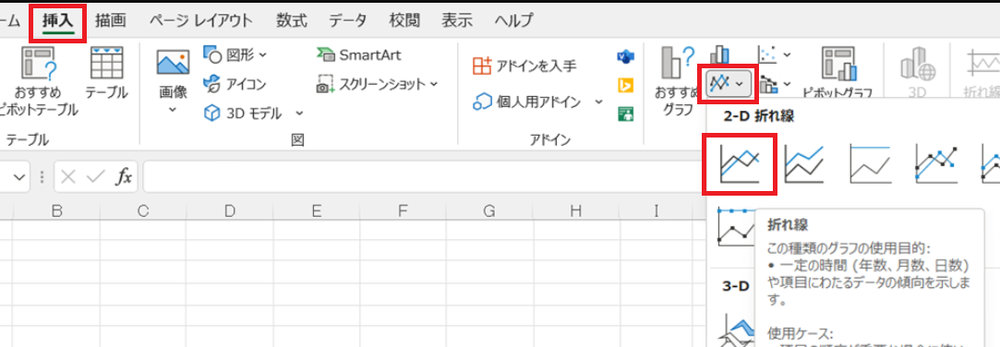
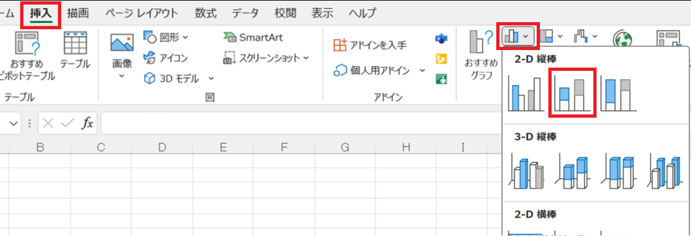
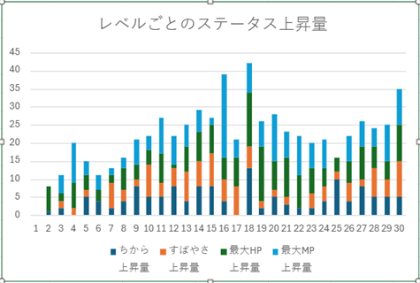

# グラフの作り方

## 1. 表からグラフを作る

### 1.1 ステータスの変化を折れ線グラフにする

条件付き書式や入力規則を使うと、入力ミスを防ぐことができます。しかし、「適切な成長速度になっているか」とか「敵の強さはレベル帯に合っているか」といった情報は、これらの「入力をチェックする」方法では調べられません。

かといって、「じっくりと表をながめて適切なデータかどうかを確認する」というのでは時間がかかりすぎ、見つけられる保証もありません。

「グラフ」は、このような場合に役立ちます。グラフを使って情報を視覚化することで、数値を見ているだけでは気づかないような問題が見つかる可能性があるからです。

例として、ステータスの成長を折れ線グラフにしてみましょう。以下の手順で折れ線グラフを作成してください。

1. 「成長」シートをクリック
2. C1～F31セルを範囲選択(ちから、すばやさ、最大HP、最大MPの４つを選択)
3. 「挿入」タブの「グラフ」グループにある「折れ線グラフ」アイコン(📈)をクリック
4. 表示されたグラフのリストにある「折れ線」をクリック
5. 作成されたグラフをドラッグして、表の右側の、表と重ならない位置に移動

このように、Excelでグラフを作成するには「グラフにしたい範囲を選択」して「グラフの種類を選ぶ」だけです。

また、選択範囲に見出しを含めておくと、見出しを使ってグラフの凡例を作ってくれます。

作成されたグラフがおおよそ直線になっていれば、うまくデータを入力できています。大きく上下にぶれている部分があれば、その部分のデータは見直しが必要です。

### 1.2 グラフのタイトルを変更する

グラフの上部には、グラフのタイトルが表示されます。タイトル部分をダブルクリックすると、タイトルテキストを変更できます。変更したら、`Enter`キーで入力を確定します。

タイトルをダブルクリックして、「ステータスの変化」というテキストに変更してください。

>**【タイトル以外を変更するには】** 
>タイトル以外のグラフ要素も、その要素をダブルクリックすることで変更できます。例えば、軸の間隔を変更するには、変更したい軸の要素(縦軸なら`50`や`100`という数値部分)をダブルクリックします。

<pre class="tnmai_assignment">
<strong>【課題１】</strong>
「ステータスの変化」グラフの縦軸の間隔を、現在の50から、20に変更しなさい。
</pre>

<pre class="tnmai_assignment">
<strong>【課題２】</strong>
「経験値」列を範囲選択し、折れ線グラフを作成しなさい。
作成したグラフは、「ステータスの変化」グラフの下に配置すること。
</pre>

### 1.3 ステータスの上昇量を積み上げグラフにする

グラフの作成でもっとも<ruby>厄介<rt>やっかい</rt></ruby>なのは、「適切な種類を選ぶ」ことです。主要なグラフの種類と用途を、以下の表に示します。

| 種類 | 用途 |
|:----:|:----|
| 棒グラフ | 棒の高さで、量の大小を比較する |
| 折れ線グラフ | 量が増えているか減っているかという、変化の方向を見る |
| 円グラフ | 全体の中での構成の比率を見る |
| 積み上げグラフ | 複数のデータについて、構成の比率を比較する |
| ヒストグラム | データの分布を見る |
| 箱ひげ図 | 複数のデータについて、分布を比較する |

例えば、レベルアップ時のステータスが上がりすぎたり、上がらなさすぎたりしていないことを調べるには、「積み上げグラフ」が適しています。

1. H1～K31セルを範囲選択(ちから上昇量、すばやさ上昇量、最大HP上昇量、最大MP上昇量の4つ)
2. 「挿入」タブの「グラフ」グループにある「縦棒グラフ」アイコン(📊)をクリック
3. 表示されたグラフのリストにある「積み上げ縦棒」をクリック
4. タイトルをダブルクリックして、テキストを「レベルごとのステータス上昇量」に変更
5. 作成されたグラフをドラッグして、表の右側の、表と重ならない位置に移動

グラフを見ると、16, 18レベルの上昇量が他より大きくなっています。しかし、そのあいだの17レベルの上昇量がひかえめなので、この3レベルの平均を考えると、そこまで異常な値とは言えなさそうです。

さらに、よく見ると16レベルで大きく上昇するのは最大MPだけです。このグラフだけでは分かりませんが、17レベルになると最初の上位魔法を覚えます。上位魔法は消費MPが大きいため、ここで最大MPを増やすことで使いやすくしていると考えられます。

また、上位魔法の習得は、それだけで十分な成長を感じられます。新しい魔法を有効活用してもらうために、17レベルのステータス上昇量を少なめにしている、という見方もできるでしょう。実際に、18レベルでは大きくステータスが上昇します。

このように、グラフを活用すると、データの傾向や入力ミスを見つけるのに役立ちます。

>**【3Dグラフを使ってはいけない】** 
>3Dグラフはデータが見づらくなるだけなので、使ってはいけません。 
>では、なぜ3Dグラフなんてものがあるのかというと、3Dの遠近感を利用して、事実とは異なる印象を与えるためです。このようなグラフは「詐欺(さぎ)グラフ」と呼ばれます。 
>3Dグラフを使ってはいけません。
