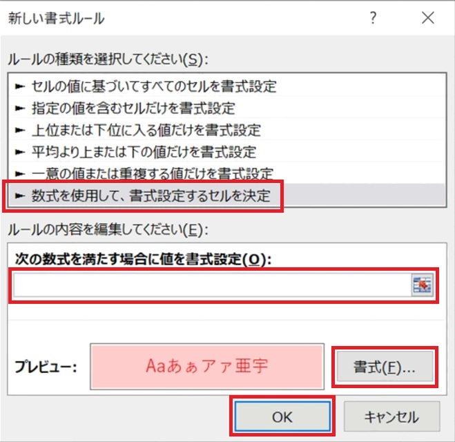

# 関数の使い方(その２)

## 1 データの抽出

### 1.1 数式に範囲を使用する(配列数式)

Excelの数式には、範囲を指定することもできます。例えば、次のような表があるとします。

|       | A | B | C |
|:-----:|--:|--:|--:|
| **1** |  3|  2|   |
| **2** |  1|  2|   |
| **3** |  4|  3|   |
| **4** |  1|  6|   |
| **5** |  5|  2|   |

この表のC1セルに`=A1:A5+B1:B5`という数式を入力すると、次のような結果になります。

|       | A | B | C |
|:-----:|--:|--:|--:|
| **1** |  3|  1|  4|
| **2** |  1|  7|  8|
| **3** |  4|  3|  7|
| **4** |  1|  2|  3|
| **5** |  5|  0|  5|

このように、数式に範囲を指定すると、範囲のそれぞれのデータをペアにして計算を行い、結果を複数のセルに出力してくれます。出力される範囲は、数式に指定した範囲と一致します。 
この例の範囲は「縦方向に５個のセル」なので、出力も「縦方向に５個のセル」となります。

Excelでは、A1:C3のような範囲のことを「配列(はいれつ)」と呼びます。配列を利用した数式は「配列数式(はいれつ・すうしき)」と呼ばれます。配列数式の出力は配列になります。

配列数式を使って、補助魔法を使う敵を識別してみましょう。 
次の手順にしたがって、配列数式を作成してください。

1. 「モンスターデータ」シートをクリック
2. Q1セルに「補助魔法の有無」と入力
3. Q2セルに`=$H$2:$H$41<>"-"`という配列数式を入力

すると、Q列には`TRUE`(トゥルー)または`FALSE`(フォルス、フォールス)のいずれかが出力されます。このように、データを複数行に出力する機能は「スピル」と呼ばれます。

>「スピル」は「こぼれる」や「あふれる」という意味の英単語です。数式を入力したセルの外にまでデータが出力される様子を、英語で「あふれる」と表現したものです。

`TRUE`と`FALSE`は論理値(ろんりち)と呼ばれるデータです。 
日本語では「`TRUE` = 真(しん)」、「`FALSE` = 偽(ぎ)」と訳されます。

それから、`<=`や`<>`などを使って「数値や文字列を比較する数式」のことを、

&emsp;&emsp;**条件式(じょうけんしき)**

といいます。そして、条件式の結果は論理値になります。例えば、`A2>=10`という条件式の場合、A2セルのデータが10以上なら`TRUE`、10未満なら`FALSE`になるわけです。

>**【スピルの欠点】** 
>配列数式などによって作成されたスピルは、データを並び替えたりテーブルに含めることができません。これらの機能を使いたい場合は、スピルで作成した列を除外するか、スピルに頼らず必要なすべてのセルに式を書きます。

<pre class="tnmai_assignment">
<strong>【課題１】</strong>
「モンスターデータ」シートのR1セルに「攻撃魔法・特殊攻撃を使う敵」と入力しなさい。
次に、R2セルに「攻撃魔法・特殊攻撃列の範囲J2:J41が<code>"-"</code>ではない」をあらわす数式を入力しなさい。
</pre>

### 1.2 FILTER(フィルター)

大抵の関数は、指定された範囲になんらかの処理を行い(数字を全部合計するとか、特定のデータを見つけるとか)、ひとつのデータを出力します。しかし、いくつかの関数は２つ以上のデータを出力します。

例えば、Excel 2021で追加された`FILTER`(フィルター)関数は、条件に一致するすべてのデータを出力します。

`FILTER(処理する範囲, 表示判定を行う配列)`

`FILTER`関数の動作を見るため、次の手順にしたがって、「補助魔法を使う敵」だけをリストアップしてください。

1. 「敵の行動」シートをクリック
2. シートタブの右端にある`+`アイコンをクリックして、新しいシートを追加
3. 追加された`Sheet1`シートの名前を`敵の分析`に変更
4. 「敵の分析」シートをクリック
5. A1セルに「補助魔法を使う敵」と入力(これは表全体の見出しです)
6. A2セルに「番号」、B2セルに「名前」と入力(これは列の見出しです)
7. A3セルに`=FILTER(モンスターデータ!$A$2:$A$41, モンスターデータ!$H$2:$H$41<>"-")`という数式を入力
8. B3セルに`=FILTER(モンスターデータ!$B$2:$B$41, モンスターデータ!$H$2:$H$41<>"-")`という数式を入力

`FILTER`関数によって、補助魔法を使う敵だけがリストアップされていれば成功です。

この`FILTER`関数の「表示判定を行う配列」には、前節で敵シートのQ2セルに入力したものと同じ数式を設定しています。つまり、この部分は`TRUE`と`FALSE`の配列になります。

>配列数式と同じく、`FILTER`関数によって出力されたセルも「スピル」です。そのため、並び替えやテーブル化はできません。

<pre class="tnmai_assignment">
<strong>【課題２】</strong>
「敵の分析」シートのA21セルに「攻撃魔法・特殊攻撃を使う敵」と入力しなさい。
次に、A22セルとB22セルに「番号」、「名前」と入力しなさい。
入力したら、A23セルとA24セルに、<code>FILTER</code>関数を使って「攻撃魔法・特殊攻撃を使う敵」をスピル形式で出力する数式を入力しなさい。
</pre>

## 2 論理演算(ろんり・えんざん)

### 2.1 AND(アンド)

条件付き書式に「複数の条件」を指定したい場合があります。例えば「種類が武器**以外**のとき、攻撃力列のセルに何かが入力されたらセルの色を変えたい」という場合、「種類が武器以外」と「攻撃力に何か入力されている」という２つの条件を調べる必要があります。

Excelで複数の条件を指定する方法は２つあります。

| 方法 | 出力 | 書き方 | 例 |
|:-----|:-----|:-------|:---|
| AND関数 | 論理値 | AND関数のカッコの中に、条件をカンマ区切りで書く | `AND(D2<>"武器", E2<>"")` |
| *演算子 | 数値 | 条件をカッコで囲んで乗算する | `(D2<>"武器")*(E2<>"")` |

`AND`関数は「複数の条件がすべて**満たされる**場合に`TRUE`、そうでなければ`FALSE`を出力」します。

`*`演算子(じょうざん・えんざんし)は「乗算」を行います。また、Excelの論理値を計算式に入れると、計算の前に自動的に`TRUE`を`1`に、`FALSE`を`0`に変換し、それから計算が行われます。

どちらの方法でも複数の条件を調べられます。`*`のほうが記述は簡単ですが、読みやすさの点ではAND関数が勝ります。

ただし、比較対象が配列の場合は注意が必要です。方法によって動作が異なるためです。

| 方法 | 出力 | 動作の説明 |
|:----:|:----|:-----|
| AND関数 | ひとつの論理値 | 配列のすべてのデータが条件を満たすなら`TRUE`、 ひとつでも満たさないデータがあれば`FALSE`を出力 |
| *演算子 | 数値の配列 | 配列の各データについて乗算を行い、計算結果の配列を出力 |

例えば、`FILTER`関数の「表示判定を行う配列」には、当然ながら「配列」を指定しなくてはなりません。そのため、`*`演算子しか使えません。

前置きはここまでにして、実際に`AND`関数を使ってみましょう。現在、アイテムシートの攻撃力と守備力には、`*`演算子を使った条件付き書式が設定されているはずです。 
これを、`AND`関数で置き換えてみます。

次の手順にしたがって、「種類が武器外のとき、攻撃力に何かが入力されたら、セルの色を変える」条件付き書式を作成してください。

1. 「アイテム」シートをクリック
2. 「攻撃力」列のE2～E35セルを範囲選択
3. 「ホーム」タブから「条件付き書式」→「新しいルール」をクリック
4. 「数式を使用して、書式設定するセルを決定」を選択
5. 「次の数式を満たす場合に値を書式設定」欄に、`=AND(D2<>"武器", E2<>"")`という数式を入力
6. 右下の「書式」ボタンをクリックして「セルの書式設定」を開き、「背景色」を赤色(または他の目立つ色)に設定
7. 「OK」をクリック

次に、`*`演算子を使ったルールを削除します。次の手順にしたがって、既存の条件付き書式を削除してください。

1. 「ホーム」タブから「条件付き書式」→「ルールの管理」をクリック
2. 「武器以外のとき攻撃力が設定されている」ルールを削除

削除したら、種類が「武器」以外の「攻撃力」列のセル(どこでも構いません)に、数値を入力してみてください。背景色が変化したら成功です。確認後、入力した数値は削除してください。

このように、`AND`関数と`*`演算子は、どちらも「２つの条件を組み合わせる」機能を持ちます。違いは、`*`演算子には「掛け算」と「組み合わせ」の両方の機能があるのに対して、
`AND`関数の機能は「組み合わせ」だけという点です。

`AND`関数のほうが読みやすいので、基本的には`AND`関数を使うとよいでしょう。 
そして、スピルなどの目的があって配列が必要な場合のみ、`*`演算子を使います。

<pre class="tnmai_assignment">
<strong>【課題３】</strong>
<code>AND</code>関数を使って、「守備力」列のF2～F35セルに、
以下の３つの条件が満たされたときにセルの背景色を変える「条件付き書式」を作成しなさい。

・種類列が鎧以外
・種類列が盾以外
・守備力列のE2セルが空ではない
</pre>

<pre class="tnmai_assignment">
<strong>【課題４】</strong>
「種類が鎧以外」「種類が盾以外」「守備力が空ではない」条件付き書式のうち、*演算子のほうを削除しなさい。
</pre>

### 2.2 OR(オア)

「複数の条件が、少なくとも１つ満たされる」ことを知りたい場合があります。 
例えば、「店の種類が`鍵`、または`聖水`、または`宿`のとき」を調べたい場合です。 
これには以下の２つの方法があります。

| 方法 | 出力 | 書き方 |
|:-----|:-----|:-------|
| OR関数 | `TRUE` `FALSE` | OR関数のカッコの中に、条件をカンマ区切りで書く 例: `OR(C2="鍵", C2="聖水", C2="宿")` |
| +演算子 | 数値 | 条件をカッコで囲んで加算する 例: `(c2="鍵")+(C2="聖水")+(C2="宿")` |

`OR`関数は、「複数の条件が、少なくとも１つ満たされる」場合に`TRUE`、すべて満たされない場合に`FALSE`を出力します。上記とは別の例を見てみましょう。

`OR(A2<10, B2>7, C2=4)`

この数式では、例えばC2セルが`4`なら、他の２つの条件は不成立でも`TRUE`が出力されます。同様に、A2セルが`9`なら、B2、C2セルの数値がなんであろうと`TRUE`になります。 
B2セルが`8`の場合も同じで、他の２つが不成立でも`TRUE`です。

なお、「少なくとも１つ」満たされればいいので、２つ以上の条件式が満たされる場合も
`TRUE`になります。

`OR`関数は「複数の条件がすべて**満たされない**場合に`FALSE`、そうでなければ`TRUE`を出力する」と考えてもよいでしょう。

そして、`OR`関数と`AND`関数を組み合わせると、より複雑な条件を作成できます。次の手順にしたがって、「店の種類が`鍵`、`聖水`、`宿`のいずれかのとき、価格が入力されていなければセルの色を変える」条件付き書式を作成してください。

1. 「店」シートをクリック
2. 「価格」列のD2～D23セルを範囲選択
3. 「ホーム」タブから「条件付き書式」→「新しいルール」をクリック
4. 「数式を使用して、書式設定するセルを決定」を選択
5. 「次の数式を満たす場合に値を書式設定」欄に、`=AND(OR(C2="鍵", C2="聖水", C2="宿"), D2="")`という数式を入力
6. 右下の「書式」ボタンをクリックして「セルの書式設定」を開き、「背景色」を赤色(または他の目立つ色)に設定
7. 「OK」をクリック

実験として、鍵、聖水、宿のいずれかの価格を`delete`キーで削除してみてください。セルの色が変化したら、条件付き書式の設定は成功です。色が変わることを確認したら、`Ctrl+Z`で、削除した数値を元に戻してください。

>**【関数と演算子の読みやすさの違い】** 
>この`AND`関数と`OR`関数の組み合わせは、次のように`*`演算子と`+`演算子でも実現できます。 
>
>`=((C2="鍵")+(C2="聖水")+(C2="宿"))*(D2="")`
>
>ですが、この式は、どれが「いずれかの条件が満たされたとき」で、どれが「すべての条件が満たされたとき」なのかが分かりにくいです。条件が複雑になるほど、関数のほうが読みやすくなります。

<pre class="tnmai_assignment">
<strong>【課題５】</strong>
<code>AND</code>関数と<code>OR</code>関数を使って、「価格」列のD2～D23セルに、
以下の２つの条件が満たされたときにセルの背景色を変える「条件付き書式」を作成しなさい。

・種類列が「武器と防具」または「道具」
・価格列のD2セルが空白ではない
</pre>

## 3 データの検索

### 3.1 XLOOKUP(エックス・ルックアップ)

成長シートに習得魔法が表示されていると、成長データの確認がしやすくなります。魔法シートを参照して、自動的に取得魔法を表示できると便利です。

こんなときは、Excel 2021で追加された`XLOOKUP`(エックス・ルックアップ)関数を使います(`lookup`は「検索する」という意味です)。`XLOOKUP`関数は次のように書きます。

`XLOOKUP(検索するデータ, 検索範囲, 出力範囲, 見つからない場合の出力)`

`XLOOKUP`は、「検索するデータ」が「検索範囲」の先頭から何番目にあるかを調べます。そして、「出力範囲」の同じ位置にあるセルの内容を出力します。「検索するデータ」が見つからない場合、「見つからない場合の出力」に指定したデータが出力されます。

なお、「見つからない場合の出力」は省略可能です。省略した場合は`#N/A`というExcel共通のエラー文字列が使われます。

例えば、以下のような成績表があるとして、「キャロル」の国語の点数をF2セルに表示したい場合を考えます。

|       | A | B | C | D | E | F |
|:-----:|--:|--:|--:|--:|:-:|:-:|
| **1** | 番号 | 名前     | 数学 | 国語 | | 検索 |
| **2** | 1    | アクセル | 4 | 8 | | (ここに表示したい) |
| **3** | 2    | ボブ     | 8 | 6 | | |
| **4** | 3    | キャロル | 7 | 9 | | |
| **5** | 4    | デニス   | 3 | 4 | | |
| **6** | 5    | エリー   | 5 | 5 | | |

この場合、F2セルに次の数式を書くことで実現できます。

`=XLOOKUP("キャロル", B2:B6, D2:D6)`

この数式では、`XLOOKUP`は次の手順で出力データを決定します。

1. 範囲B2:B6から「キャロル」というデータを検索
2. 「キャロル」を先頭から３番目で発見
3. 範囲D2:D6の３番目、つまりD4セルのデータを出力

`XLOOKUP`の動作を見るため、次の手順にしたがって、「成長」シートに「習得魔法」を表示する列を作成してください。

1. 「成長」シートをクリック
2. L1セルに「習得魔法」と入力
3. L2セルに`=XLOOKUP(A2, 魔法!$B:$B, 魔法!$A:$A, "")`という数式を入力
4. L2の数式をL31までオートフィル

ここでは、範囲を指定するときに「列番号を省略」しています。列番号を省略すると、列全体が範囲になります。

>列ではなく、行番号を省略することも可能です。例えば2:2のように書くと、２行目全体が範囲になります。

次に、「補助魔法を使う敵」の「魔法名」を表示してみましょう。

1. 「敵の分析」シートをクリック
2. B1セルに「魔法名」と入力
3. B2セルに`=XLOOKUP(A3:A17, モンスターデータ!$B:$B, モンスターデータ!$H:$H)`という数式を入力

この例では、「検索するデータ」に「範囲」を指定しています。`XLOOKUP`などの一部の関数は、「データとして範囲を指定する」と配列数式になります。

>`XLOOKUP`関数はExcel 2021で追加されたため、Excel 2019以前のバージョンでは使えません。Excel 2019以前のバージョンで`XLOOKUP`の動作を再現するには、 
>`INDEX`関数と`MATCH`関数を組み合わせます。

<pre class="tnmai_assignment">
<strong>【課題６】</strong>
<code>XLOOKUP</code>関数を使って、E列に「魔法・特殊攻撃名」を出力しなさい。
</pre>

<pre class="tnmai_assignment">
<strong>【課題７】</strong>
「敵の分析」シートにある「補助魔法を使う敵」と「攻撃魔法・特殊攻撃を使う敵」の２つの表につい
て、表として見やすくなるように、フォントや背景色を変更したり、枠線を設定しなさい。
</pre>
