# グラフの作り方

## 1. 表からグラフを作る

### 1.1 ステータスの変化を折れ線グラフにする

条件付き書式や入力規則を使うと、入力ミスを防ぐことができます。しかし、「適切な成長速度になっているか」とか「敵の強さはレベル帯に合っているか」といった情報は、これらの「入力をチェックする」方法では調べられません。

かといって、「じっくりと表をながめて適切なデータかどうかを確認する」というのでは時間がかかりすぎ、見つけられる保証もありません。

「グラフ」は、このような場合に役立ちます。グラフを使って情報を視覚化することで、数値を見ているだけでは気づかないような問題が見つかる可能性があるからです。

例として、ステータスの成長を折れ線グラフにしてみましょう。以下の手順で折れ線グラフを作成してください。

1. 「成長」シートをクリック
2. C1～F31セルを範囲選択(ちから、すばやさ、最大HP、最大MPの４つを選択)
3. 「挿入」タブの「グラフ」グループにある「折れ線グラフ」アイコン(📈)をクリック
4. 表示されたグラフのリストにある「折れ線」をクリック
5. 作成されたグラフをドラッグして、表の右側の、表と重ならない位置に移動

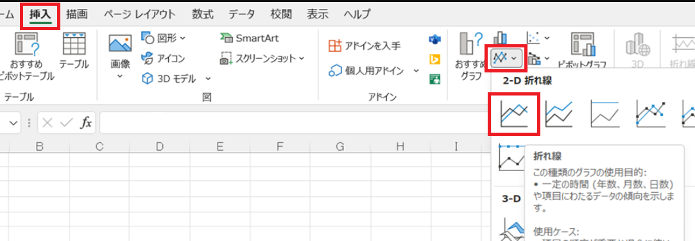

このように、Excelでグラフを作成するには「グラフにしたい範囲を選択」して「グラフの種類を選ぶ」だけです。

また、選択範囲に見出しを含めておくと、見出しを使ってグラフの凡例を作ってくれます。

作成されたグラフがおおよそ直線になっていれば、うまくデータを入力できています。大きく上下にぶれている部分があれば、その部分のデータは見直しが必要です。

### 1.2 グラフのタイトルを変更する

グラフの上部には、グラフのタイトルが表示されます。タイトル部分をダブルクリックすると、タイトルテキストを変更できます。変更したら、`Enter`キーで入力を確定します。

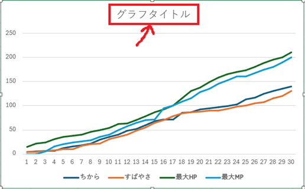

タイトルをダブルクリックして、「ステータスの変化」というテキストに変更してください。

>**【タイトル以外を変更するには】** 
>タイトル以外のグラフ要素も、その要素をダブルクリックすることで変更できます。例えば、軸の間隔を変更するには、変更したい軸の要素(縦軸なら`50`や`100`という数値部分)をダブルクリックします。

<pre class="tnmai_assignment">
<strong>【課題１】</strong>
「ステータスの変化」グラフの縦軸の間隔を、現在の50から、20に変更しなさい。
</pre>

<pre class="tnmai_assignment">
<strong>【課題２】</strong>
「経験値」列を範囲選択し、折れ線グラフを作成しなさい。
作成したグラフは、「ステータスの変化」グラフの下に配置すること。
</pre>

### 1.3 ステータスの上昇量を積み上げグラフにする

グラフの作成でもっとも<ruby>厄介<rt>やっかい</rt></ruby>なのは、「適切な種類を選ぶ」ことです。主要なグラフの種類と用途を、以下の表に示します。

| 種類 | 用途 |
|:----:|:----|
| 棒グラフ | 棒の高さで、量の大小を比較する |
| 折れ線グラフ | 量が増えているか減っているかという、変化の方向を見る |
| 円グラフ | 全体の中での構成の比率を見る |
| 積み上げグラフ | 複数のデータについて、構成の比率を比較する |
| ヒストグラム | データの分布を見る |
| 箱ひげ図 | 複数のデータについて、分布を比較する |

例えば、レベルアップ時のステータスが上がりすぎたり、上がらなさすぎたりしていないことを調べるには、「積み上げグラフ」が適しています。

1. H1～K31セルを範囲選択(ちから上昇量、すばやさ上昇量、最大HP上昇量、最大MP上昇量の4つ)
2. 「挿入」タブの「グラフ」グループにある「縦棒グラフ」アイコン(📊)をクリック
3. 表示されたグラフのリストにある「積み上げ縦棒」をクリック
4. タイトルをダブルクリックして、テキストを「レベルごとのステータス上昇量」に変更
5. 作成されたグラフをドラッグして、表の右側の、表と重ならない位置に移動

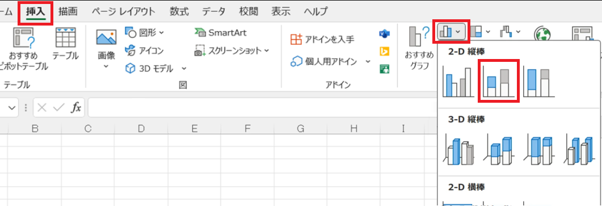

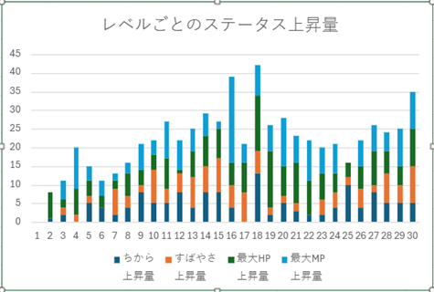

グラフを見ると、16, 18レベルの上昇量が他より大きくなっています。しかし、そのあいだの17レベルの上昇量がひかえめなので、この3レベルの平均を考えると、そこまで異常な値とは言えなさそうです。

さらに、よく見ると16レベルで大きく上昇するのは最大MPだけです。このグラフだけでは分かりませんが、17レベルになると最初の上位魔法を覚えます。上位魔法は消費MPが大きいため、ここで最大MPを増やすことで使いやすくしていると考えられます。

また、上位魔法の習得は、それだけで十分な成長を感じられます。新しい魔法を有効活用してもらうために、17レベルのステータス上昇量を少なめにしている、という見方もできるでしょう。実際に、18レベルでは大きくステータスが上昇します。

このように、グラフは、データの傾向や入力ミスを見つけるのに役立ちます。

>**【3Dグラフを使ってはいけない】** 
>3Dグラフはデータが見づらくなるだけなので、使ってはいけません。 
>では、なぜ3Dグラフなんてものがあるのかというと、3Dの遠近感を利用して、事実とは異なる印象を与えるためです。このようなグラフは「詐欺(さぎ)グラフ」と呼ばれます。 
>3Dグラフを使ってはいけません。

### 1.4 グラフ用のデータを計算する

グラフに必要なデータが既存の表に存在しない場合、グラフ用のデータを作成する必要があります。

例えば、「遭遇表の番号が、遭遇マップに配置された数」を比較したいとします。そのために「遭遇表の番号ごとに、遭遇マップに配置された数」を数え、表にしなくてはなりません。

特定の値を数えるには、`COUNTIF`関数を使うと簡単です。また、数列を作るには`SEQUENCE`(シーケンス)関数が便利です。次の手順にしたがって、遭遇マップに配置された番号の数を計算してください。

1. 「遭遇マップ」シートを選択
2. J1セルに「配置数」という見出しを入力
3. J2セルに数式`=COUNTIF($A$1:$H$8, SEQUENCE(14))`と入力

`COUNTIF`関数の第２引数にセル範囲を指定すると、結果はスピルになります。つまり、結果が複数行に出力されます。

`SEQUENCE`関数は`1`から始まる連続した数列を作成する関数で、次のように書きます。

`SEQUENCE(行数, 列数, 最初の数値, 増分)`

「行数」以外のパラメータは省略可能です。省略すると`1`が指定されたとみなされます。先に書いた`SEQUENCE(14)`の場合、次のような14行1列の数列が作成されるわけです。

`{ 1; 2; 3; 4; 5; 6; 7; 8; 9; 10; 11; 12; 13; 14 }`

>ここで`{`と`}`は配列や範囲をあらわします。また、`;`は行の区切りをあらわします。

これで必要なデータを準備できたので、グラフを作成しましょう。次の手順にしたがって、グラフを作成してください。

1. 「遭遇マップ」シートをクリック
2. J1～J15セルを範囲選択(見出し及びデータがスピルされた範囲)
3. 「挿入」タブの「グラフ」グループにある「縦棒グラフ」アイコンをクリック
4. 表示されたグラフのリストにある「集合縦棒」をクリック
5. 作成されたグラフをドラッグして、「配置数」表の右側の、表と重ならない位置に移動
6. 表の四隅と上下左右にある◯アイコンをドラッグして、大きさを調整

8x8=64マス14個の番号を振るのですから、すべての番号が均等に配置されたとすると、それぞれの番号は約4.5個ずつ配置されるはずです。

しかし、実際にグラフを見てみると、番号によって配置数は異なります。配置数が多いほど、そのレベル帯の敵と戦う回数が多くなります。目立って多いのは6番と13番です。

遭遇マップと見比べてみると、6番はマップ左上の探索を終えて、マップ右上の探索に進む目安となる遭遇表のようです。13番は、マップ中央にある最後のダンジョンに向けて、経験を積むための遭遇表でしょう。この遭遇表の敵に苦労するようでは、最後のダンジョンに挑むのはまだ早いということです。

このように、既存のデータからでは適切なグラフを作成できない場合、「グラフ用の表を作成する」という方法を使います。

## 2 円グラフ

### 2.1 魔法を使う敵と使わない敵の比率を円グラフにする

円グラフは、２つまたは３つの要素の比率を調べるときに便利です。見やすい円グラフの目安として、比較する要素数は多くても５個以下にします。要素数が多いほど「扇形（おうぎがた)の大きさの違い」を見分けることが難しくなるからです。

また、要素数が４個や５個の場合でも、補助的に数値を添えたり、比率が高い順に並べるなどの工夫が必要です。

例として、魔法を使わない敵と使う敵の数を調べて、円グラフとして比率を視覚化してみましょう。まずは、次の手順にしたがって、グラフ用の表を作成してください。

1. 「敵の分析」シートを選択
2. E1セルに「行動の種類」、F1セルに「総数」と入力
3. E2～E5セルに次の文章を入力
    * 通常攻撃のみ
    * 通常攻撃+補助魔法
    * 通常攻撃+攻撃魔法・特殊攻撃
    * 全て
4. F2セルに数式`=SUM((モンスターデータ!$H$2:$H$41="-")*(モンスターデータ!$J$2:$J$41="-"))`と入力
5. F3セルに数式`=SUM((モンスターデータ!$H$2:$H$41<>"-")*(モンスターデータ!$J$2:$J$41="-"))`と入力
6. F4セルに数式`=SUM((モンスターデータ!$H$2:$H$41="-")*(モンスターデータ!$J$2:$J$41<>"-"))`と入力
7. F5セルに数式`=SUM((モンスターデータ!$H$2:$H$41<>"-")*(モンスターデータ!$J$2:$J$41<>"-"))`と入力

4～7の数式では「２つの条件を調べて、どちらの条件も成立するセルの数」を求めています。

「モンスターデータ」シートのH列には「補助魔法」、J列には「攻撃魔法・特殊攻撃」が書かれているはずです。そして、これらの列のセルが`-`の場合、魔法や特殊攻撃を使わないことを意味します。

そこで、２つの列について「`-`と等しい(魔法を使わない)」、「`-`と等しくない(魔法を使う)」を調べます。そして、乗算によって２つの条件が共に満たされる場合に`1`、それ以外は`0`となる配列を作成します。最後に、`SUM`関数で配列の合計を求めます。

続いて、作成した表から円グラフを作ります。次の手順にしたがって、円グラフを作成してください。

1. E1:F5を範囲選択
2. 「挿入」タブにある「円」グラフから、「2D円」を選択
3. 「行動の種類」表の右側に円グラフを移動

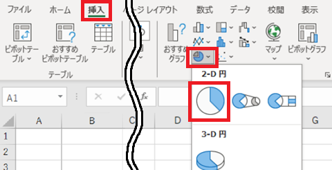

さて、初期設定の円グラフはあまり見やすくありません。見やすい円グラフにするには、以下の作業を行ってグラフの書式を適切に設定します。

* タイトルの変更
* 凡例の削除
* データラベルの表示設定
* データラベルの位置調整

手始めに、グラフのタイトルを変更しましょう。

#### テキストの変更

1. タイトル部分をダブルクリックして、テキストを「行動の種類」に変更

#### 配置の変更

1. グラフの右側にある`+`アイコンをクリック(Web版の場合はグラフをダブルクリック)
2. 「グラフ要素」リストから「グラフ タイトル」の横にある三角形`▶`を選択
3. 「グラフタイトルを中央揃えて重ねて配置」をクリック

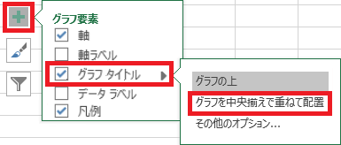

#### 位置の変更

1. タイトル部分をクリック
2. マウスカーソルが「矢印付き十字」に変化したら、マウスドラッグでグラフ領域の左上に移動

タイトルを変更したら、次に「凡例(はんれい)」を削除します。凡例はグラフの下に表示されている「グラフの色と項目の対応関係」です。円グラフの場合、このような一覧表示では対応関係が分かりにくいので、代わりにデータラベルで表示することが多いです。

次の手順にしたがって、凡例を削除してください。

1. グラフの右側にある`+`アイコンをクリック(Web版の場合はグラフをダブルクリック)
2. 「凡例」のチェックをクリックしてマークを消す

>他にも、凡例を選択して`Delete`キーを押す、右クリックすると表示されるメニューから削除を選ぶ、リボンから削除する、などの方法があります。

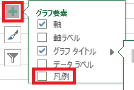

次に、凡例の代わりとなるデータラベルを追加します。次の手順にしたがって、データラベルを追加してください

1. グラフの右側にある`+`アイコンをクリック(Web版の場合はグラフをダブルクリック)
2. 「データ ラベル」のチェックをクリックしてマークする
3. データラベル項目の右にある`▶`アイコンからリストを表示し、「内側先端」をクリック

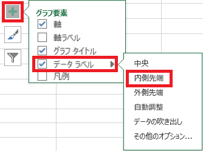

するとデータラベルが追加されます。データラベルの配置の違いは、次のようになります。

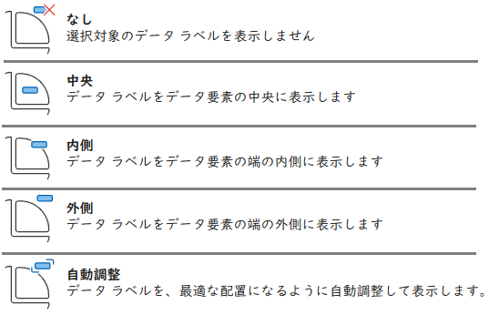

これらの配置は、ラベルに表示する内容や、グラフの要素数などを考慮して使い分けます。

さて、データラベルとして最初に表示されるのは、円グラフの分割に使った数値です。この数値では凡例の代わりにならないので、次の手順にしたがって、データラベルの書式設定を行ってください。

1. グラフの右側にある`+`アイコンをクリック(Web版の場合はグラフをダブルクリック)
2. 「データ ラベル」項目の右にある`▶`アイコンから、「その他のオプション」を選択
3. 書式設定ウィンドウが表示されるので、以下の項目にチェックを入れ、それ以外の項目のチェックを外す
    * 分類名
    * パーセンテージ
    * 引き出し線を表示する

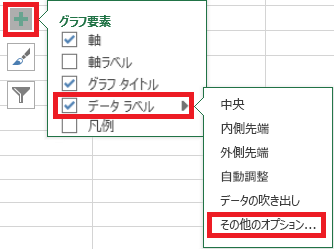

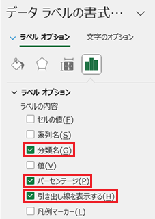

これで、データラベルが凡例の代わりになりました。データラベルが見づらい場合は、フォントの色を白などの淡い色に変えたり、太字にしてみるとよいでしょう。

### 2.2 敵が使う魔法の使用比率を円グラフにする

円グラフの練習として、４つの補助魔法ごとに使用する敵の総数を表にして、使用率をあらわす円グラフを作成します。

1. E11セルに「補助魔法名」、F11セルに「総数」と入力
2. E12セルに数式`=敵の行動!A3:A6`と入力
3. F12セルに数式`=SUM(INT($C$3:$C$17=E12))`と入力

`INT`(イント)関数は「数値を最も近い整数に切り下げる」関数です。`ROUNDDOWN`関数と似ていますが、次のような違いがあります。

| 関数名 | 桁の指定 | マイナスの数の挙動 | 例 |
|:-:|:-:|:-:|:--|
| INT | できない | 切り下げ | INT(-3.14) → -4 |
| ROUNDOWN | できる | 切り捨て | ROUNDDOWN(-3.14, 0) → -3 |

ですが、今回`INT`関数を使っているのは切り下げが目的ではなくて、`TRUE`と`FALSE`を数値の`1`と`0`に変換するためです。`SUM`関数は数値しか扱えないため、データとして`TRUE`/`FALSE`の配列を指定する場合は、何らかの方法で数値に変換する必要があるのです。

同じことは`ROUNDDOWN`関数でもできます。しかし、`INT`関数のほうが名前が短く、桁数の指定も不要なので、数式が読みやすくなるのが利点です。

それでは、次の手順にしたがって、「補助魔法の使用比率」を視覚化する円グラフを作成してください。

1. E11:F15セルを範囲選択
2. 「挿入」タブにある円グラフから「2D円グラフ」を選択
3. タイトル、凡例、データラベルを適切に設定

<pre class="tnmai_assignment">
<strong>【課題３】</strong>
４つの攻撃魔法・特殊攻撃ごとに、使用する敵の総数を表にして、「攻撃魔法・特殊攻撃の使用比率」を視覚化する円グラフを作成しなさい。
</pre>

>このテキストで紹介したほかにも、Excelのグラフにはさまざまな表示方法や設定があります。いろいろ試してみるとよいでしょう。
