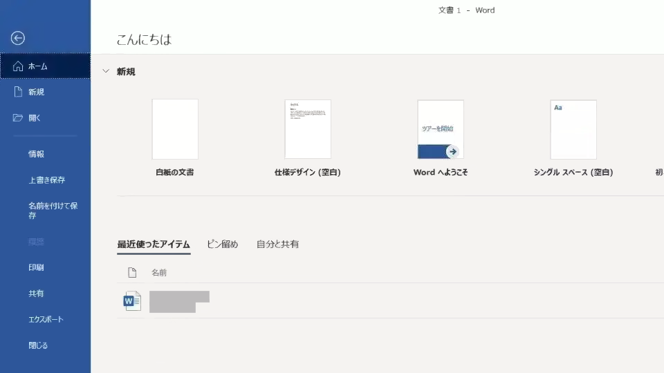
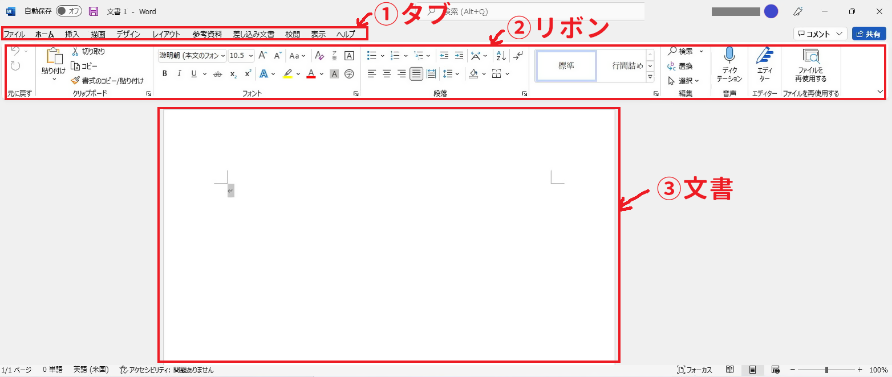
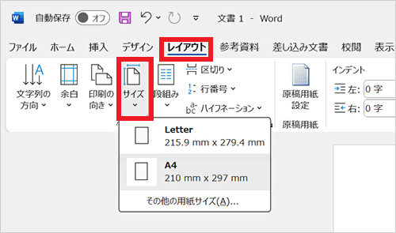
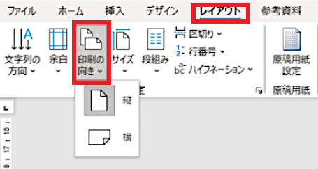
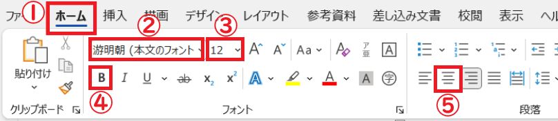
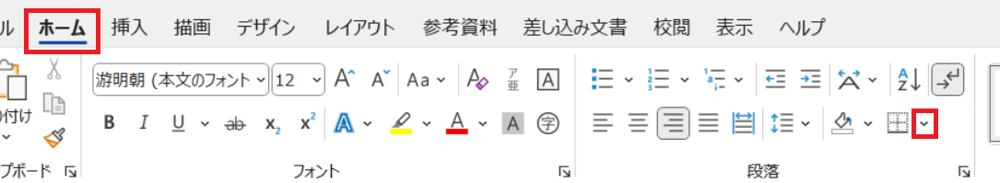
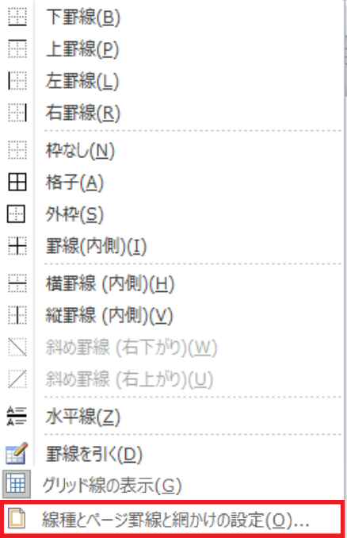
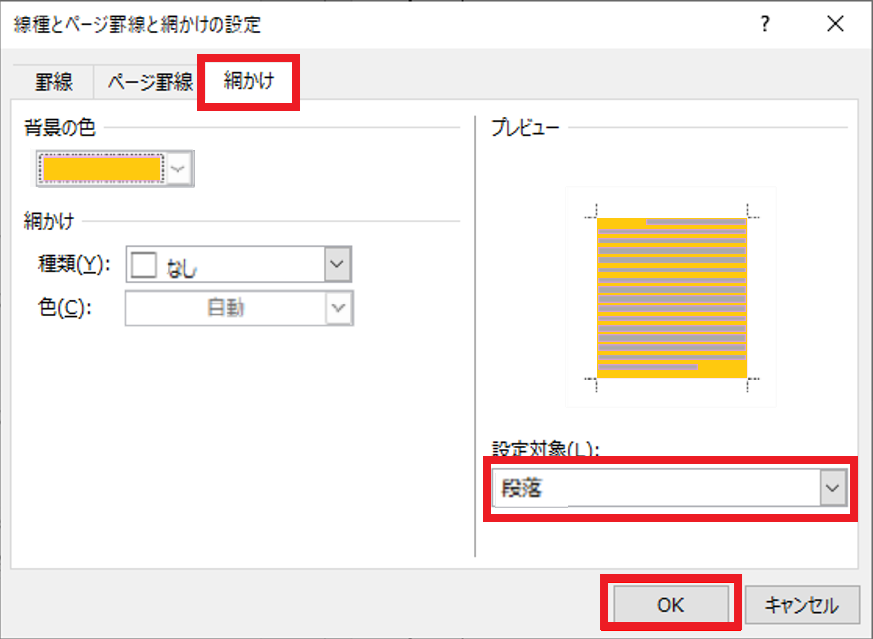

# Word(ワード)のつかいかた

## 1 Wordの画面構成

### 1.1 Word(ワード)とは何者か

Word(ワード)は「ワード・プロセッサ・ソフトウェア(文書作成ソフト)」です。企画書や報告書、通知書といった「文書」を作成するために使います。

必要に応じて、画像や表、グラフを入れることもできます。

### 1.2 WordとExcelの違い

Wordは主に「文字データ」を扱い、データを文書としてデザインして印刷することが目的です。

Excelは主に「数値データ」を扱い、データを加工・分析したり、データベースとして利用する(例えば、分析した表やグラフをWord文書に貼り付ける)ことが目的です。

ただし、罫線を多用するような文書(例えば履歴書)では、Excelが使われることもあります。

### 1.3 Wordの画面構成

Wordを起動すると、「スタート画面」が表示されます。

「白紙の文書」または「白紙のドキュメントを作成」を選ぶと、次のようなA4サイズの空白用紙が表示された「基本画面」が表示されます。

1. タブ: 表示するリボンの種類を切り替えます。
2. リボン: タブで選択した機能が表示されます。
3. 文書: 作業対象の文書です。

## 2 文書の書きかた

### 2.1 用紙のサイズと向き

文書を作成する前に、用紙のサイズと向きを決めましょう。これらはいつでも変更できますが、設定を変えるたびに文書のレイアウトをすべてやり直す必要があります。レイアウトのやり直しが起きないように、サイズと向きを最初に決めるのがベストです。

用紙サイズを設定するには、「レイアウト」タブをクリックし、次に「サイズ」ボタンをクリックします。すると、選択可能な用紙サイズが表示されるので、文書に合うサイズを選びます。特に指定がない場合は「A4」を選びます。

用紙の向きを設定するには、「レイアウト」タブをクリックし、次に「印刷の向き」ボタンをクリックします。文書に応じて、「縦」または「横」を選びます。一般的な文書は「縦」にしますが、企画書など図や画像を多用する場合は「横」を選ぶとよいでしょう。

### 2.2 文書を入力する

文書の例として、就職活動でありがちな「自己紹介文」を入力してください。カッコ内は、自分及び目標としている企業の情報で置き換えること。

>自己紹介
>
>&ensp;はじめまして、バンタンゲームアカデミー(所属学部)(年次)の(氏名)と申します。 
>(任意のゲームタイトル)の(任意のゲームタイトルの面白かったところ)に感動し、ゲームデザインに興味を持ちました。この経験から、ユーザー視点に立ったゲームの企画や設計を通じて、人々に楽しさや感動を届ける仕事をしたいと考えるようになりました。
>
>&ensp;ゲームプランナーを目指し、学校での学びや自主制作を通じて企画力を磨いてきました。いくつかの企画書は実際のゲーム制作プロジェクトになりました。プロジェクトでは、プログラマーやデザイナーからの意見を取り入れて、明確で分かりやすい仕様書を作成し、チームの円滑な連携をサポートしました。この経験から、異なる役割のメンバーと協力し、共通の目標に向かう重要性を学びました。 
>
>&ensp;ゲームは、技術と創造性を組み合わせて人々に新しい体験を提供できるメディアだと信じています。私はプランナーとして、ユーザーが夢中になれるゲームの企画や運営に携わり、チームで魅力的なゲーム作品を創り上げたいと考えています。
>
>&ensp;その中で、貴社の(企業理念や事業内容に関する具体的な点)や、(企業やゲームの特徴)は、私の思いと重なると感じ、強く共感しました。 私の企画能力はまだ発展途上ですが、ゲームへの情熱とチームでの協働を通じて成長する意欲を持っています。貴社の一員として、ユーザーの心を掴む企画を生み出し、クリエイティブな挑戦を続けることで貢献できるよう、全力で取り組む所存です。どうぞよろしくお願いいたします。
>
>バンタンゲームアカデミー (所属学部) (年次) 
>(氏名) 
>住所: (住所) 
>電話: (電話番号) 
>メール: (メールアドレス)

上記の例文は、自己紹介の答えではありません。ひとつの例として考えてください。実際に書く場合は、抽象的な表現を減らし、代わりに具体例を増やす必要があるでしょう。

さて、この自己紹介書は、以下の段落に別れています。

1. タイトル
2. あいさつと、ゲーム開発者を目指す動機
3. これまでの経験
4. これからの目標
5. その会社を選んだ理由(志望動機)
6. 連絡先

この中で重要な項目を２つ選ぶなら、「3. これまでの経験」と「5. その会社を選んだ理由」になるでしょう。これらは「入社したらどのような役に立つか」を説明しているからです。

>**【自己PR文として使う場合】** 
>履歴書の一部に「自己PR」などの項目が含まれていることがあります。記入欄の大きさにもよりますが、上記の「3. これまでの経験」と「4. これからの目標」、「5. その会社を選んだ理由」を短くまとめて記述するとよいでしょう。

### 2.3 フォントの種類とサイズ

「タイトル」だと分かるように、「自己紹介」のフォントと大きさ、それと位置を変更しましょう。

まず、フォントを変更したい範囲をマウスドラッグで選択します。今回は、先頭の「自己紹介」という４文字を選択してください。次に、以下の手順でフォントの書式を設定してください。

1. 「ホーム」タブをクリック。
2. 「フォント」グループの「游明朝」となっている部分をクリック。フォント一覧が開くので、「游ゴシック」を選択。
3. フォント名の右の数字`12`は、フォントのサイズ。この部分をクリックし、サイズを`16`に変更。
4. フォント名の下の **Ｂ**, *Ｉ*, <u>Ｕ</u>は、それぞれ「太字」「斜体」「下線」を意味する。今回は太字にしたいので**Ｂ**をクリック。
5. 「段落」グループは「表示位置の調整」や「リスト表示」の選択ができる。今回は中央寄せにしたいので、⑤の部分をクリック。

このように、「フォント」や「段落」グループを使うと、文章の見た目を細かく設定できます。

>**【明朝体とゴシック体】**
>
>* 「明朝体(みんちょうたい)」のフォント: とめ、はね、はらいがはっきりとしている。本文に向いている。
>* 「ゴシック体」のフォント: 縦線と横線がほぼ同じ太さで、装飾は少なめ。タイトルに向いている。

### 2.4 背景色を設定する

一般的に、自己紹介書や自己PR文、履歴書には、過度な装飾を入れるべきではありません。

ですが、これは練習なので、文章の添削を兼ねて、いくつかの装飾を付け加えてみます。まず、タイトルの背景を設定しましょう。「自己紹介」の段落をクリックし、以下の手順で背景を設定してください。

>**【Web版は「塗りつぶし」で代用】** 
>2025年5月現在、この機能はアプリ版のExcelだけで使えます。Web版では代わりに、「段落」にある「バケツ」アイコンから背景色を設定できます。

1. 「ホーム」タブをクリック。
2. 「段落」グループにある「罫線」アイコンの右側の`v`をクリック。

3. メニューが表示されるので、一番下にある「線種とページ罫線と網かけの設定」をクリック。

4. 「網かけ」タブをクリック。
5. 右下にある「設定対象」を「段落」に変更。
6. 設定したい背景色を選択(薄めの色がよいでしょう)。

文章の一部分だけに色を付けたい場合は「設定対象」を「文字」にします。例として「抽象的な表現」をしている部分を探して目立たせてみましょう。「ゲームプランナーを目指し、」で始まる２段落目の第３文に、「そのプロジェクトでは」とあります。ここは具体的なプロジェクト名や、ゲームのジャンル名を書くべきです。

1. 第２段落の第３文の先頭にある「そのプロジェクト」の部分を、マウスドラッグで選択。
2. 「ホーム」タブをクリック。
3. 「段落」グループにある「罫線」アイコンの右側の`v`をクリック。
4. メニューが表示されるので、一番下にある「線種とページ罫線と網かけの設定」をクリック。
5. 「網かけ」タブをクリック。
6. 右下にある「設定対象」を「文字」に変更。
7. 設定したい「網掛け」の種類と色を選択。

背景色や網かけを元に戻したい場合は、戻したい範囲を選択して「色なし」または「なし」を選択します。

>**【蛍光ペンについて】** 
>文字の背景色を設定する別の方法として、「フォント」グループにある「蛍光ペン」を使うこともできます。蛍光ペンはWeb版でも使えるうえに設定が簡単ですが、「あらかじめ用意された色しか使えない」という欠点があります。

<pre class="tnmai_assignment">
<strong>【課題１】</strong>
抽象的な表現だと感じたすべての単語または文章に、背景色を設定しなさい。
</pre>
