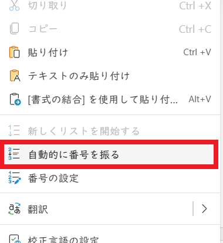

# Word文書の構造化

## 1 構造化文書

### 1.1 見出しスタイルとナビゲーションウィンドウ

Wordの「スタイル」は、フォントの種類や大きさなどを一括して指定できる機能です。文章の目的に応じて、タイトル用、見出し用、本文用など、さまざまなスタイルが用意されています。

特に「見出し」用のスタイルには「文書を構造化(こうぞうか)する」という、特別な機能があります。構造化された文書の例を次に示します。

<p align="center"></p>

このように、構造化された文書は「レベル」という概念によって階層化されます。レベルは1～9まで9段階で、下位のレベルは上位のレベルに従属する「サブ・レベル」になります。

また、「ナビゲーション・ウィンドウ」を使うと見出しを一覧表示できます。

ナビゲーション・ウィンドウを表示するには、「表示」タブにある「ナビゲーション・ウィンドウ」チェックボックスをクリックして、チェックマークを付けます。

<p align="center"></p>

ナビゲーション・ウィンドウは次のようなものです。

<p align="center"></p>

ナビゲーション・ウィンドウには、「見出し」スタイルを指定した行が階層構造で表示されます。見出しをクリックすると、その見出しの位置が画面に表示されます。

PCアプリ版では、以下の機能が使えます(2025年8月現在、Web版ではできません)。

1. 見出しをドラッグして、見出し及びサブレベル全体を移動できます
2. 見出しを右クリックしてメニューを表示し、レベルを変更したり、見出しを追加、または削除する

構造化された文書では、見出しの本文とサブレベルを折りたたんで一時的に非表示にできます。折りたたみたい見出しの上にマウスカーソルを移動させると、見出しの左に`⊿`アイコンが表示されます。この`⊿`アイコンをクリックすると、見出しとサブレベルが折りたたまれます。

ナビゲーション・ウィンドウでも、折りたたみが可能です。見出しの左にある`⊿`の部分をクリックすると、サブレベルを折りたためます。なお、文書側の折りたたみと、ナビゲーションウィンドウの折りたたみは個別の操作になります。文書側の見出しを折りたたんでも、ナビゲーションウィンドウ側では折りたたまれません。逆に、ナビゲーションウィンドウ側で折りたたんでも、文書には影響しません。

<pre class="tnmai_assignment">
<strong>【課題１】</strong>
「ナビゲーションウィンドウ」を表示しなさい。
</pre>

### 1.2 構造化された文書の作成

それでは、見出し機能を使って簡単な構造化文書を作成してみましょう。Wordを起動して新規ファイルを開き、次のテキストを入力してください。ただし、末尾の波括弧の部分は「スタイル」の指定なので、入力しないでください。例えば、

>忍者ゲームの仕様書{タイトル}

とあった場合は、「忍者ゲームの仕様書」の部分だけを書き写してください。

**テキスト**

```txt
忍者ゲームの仕様書{タイトル}

プレイヤーの動作仕様{見出し１}
プレイヤーは「ニンジャ」となり、忍術を駆使して任務達成を目指す。
忍術{見出し２}
プレイヤーは以下の忍術を使うことができる。
高跳びの術: 二段ジャンプ。
隠れ身の術: その場に合わせた置物や壁の模様になりきる。敵から視認されなくなる。
変わり身の術: 丸太や人形を身代わりにしてダメージを無効化する。発動から２秒間は、敵から視認されなくなる。
軽業(かるわざ)の術(回避): 敵の攻撃を素早く回避する。発動直後の0.5秒間は攻撃に対する衝突判定が消える。
忍刀(しのびがたな)の術(近距離攻撃): 忍刀で斬る。
手裏剣の術(遠距離攻撃): 手裏剣を投げる。
基本操作{見出し２}
プレイヤーの操作は、ゲームパッドとキーボードの両方に対応する。
```

テキストを入力し終わったら、次はスタイルを設定しましょう。まず、スタイルを指定したい行にカーソルを移動します。「忍者ゲームの仕様書」というテキストをクリックしてカーソルを移動してください。

続いて、スタイルを設定します。スタイルは「ホーム」タブにある「スタイル」グループから設定します。 スタイルグループの右端にある、`v`アイコンをクリックしてください。

<p align="center"></p>

<div style="page-break-after: always"></div>

すると、次のようなスタイル一覧が表示されます。

<p align="center"></p>

「表題」または「タイトル」と書かれているスタイルをクリックしてください。「表題」スタイルは、文書のタイトルに設定するためのスタイルです。

<pre class="tnmai_assignment">
<strong>【課題２】</strong>
「表題」のやりかたを参考にして、テキストに{見出し１}と{見出し２}のスタイルを設定しなさい。
</pre>

>**【スタイルとレベル】**<br>
>スタイルとレベルは、厳密には別の概念です。「一部のスタイルにレベルが設定されている」と考えてください。事実、PCアプリ版にはレベルを直接指定する機能あります。ただし、Web版では、見出しスタイルを使わないとレベルを指定できません(少なくとも2025年8月現在では)。<br>
>また、PC版であっても、レベルの指定には見出しスタイルを使うほうがよいでしょう。手動でレベルを指定すると、文書の見た目と構造が一致しなくなり、文書を管理しにくくなるからです。

<div style="page-break-after: always"></div>

### 1.3 箇条書き

「箇条書き」は複数の項目をリスト形式に並べた書きかたです。Wordの場合、行の先頭にアスタリスク、空白の順で書くと、`●`記号で始まる箇条書きを作成できます。

練習として、次の手順にしたがって、忍術リストを箇条書きにしてください。

1. 「高跳びの術」の行の先頭にカーソルを移動
2. 先頭に`* `(アスタリスクと空白)を書く
3. 「隠れ身の術」の行の先頭にカーソルを移動
4. 先頭に`* `(アスタリスクと空白)を書く
5. すべての術で上記と同じことを繰り返す

箇条書きを解除するには、`●`記号の直後にカーソルを置いて`back space`キーを押します。

<pre class="tnmai_assignment">
<strong>【課題３】</strong>
「基本操作{見出し２}」の「本文の下」に、以下の文章と箇条書きを追加しなさい。
箇条書きの配下に箇条書きを書く(箇条書きを子要素にする)には、子要素にしたい行の先頭にカーソルを移動し、<code>Tab</code>キーを押します。
<code>
プレイヤーの状態{見出し２}
プレイヤーは以下の状態を取りうる。
* 着地しているかどうか
   * 地上状態: 足が地面に着いている。
   * 空中状態: 足が地面から浮いている。
* 行動できるかどうか
   * 行動可能: 入力された行動ができる。
   * 硬直: 何らかの行動中で、他の行動ができない。
   * キャンセル可能: 何らかの行動中だが、他の行動に切り替えられる。
   * ダメージ: ダメージを受けている状態。「変わり身の術」のみ実行可能。
* 敵から見えるかどうか
   * 通常: 敵に認識される。
   * 隠密(おんみつ): 敵に認識されない。
* イベント実行中かどうか
   * 非イベント: イベント実行中ではない。
   * イベント: イベント実行中。
* 高跳びの術の残り回数
  「地上状態」になった瞬間、残り回数が最大値まで回復する。初期最大値は1。
   * ０回: 二段ジャンプが不可能。
   * １回以上: 二段ジャンプが可能。
</code></pre>

箇条書きには、「要点を伝えやすい」、「簡潔で読みやすい」という利点があります。伝えたい情報が複数ある場合におすすめです。内容をできるだけシンプルに、短くまとめるのがポイントです。

### 1.4 アウトライン(番号付きリスト)

見出しに番号が振ってあると、前後関係がわかりやすくなり、誰かに特定の見出しを見てもらいたいときにも役立ちます。手動で番号を振ることもできますが、文章の順番を入れ替えると番号がずれてしまいます。

この問題は、Wordの「アウトライン」(「複数レベルのリスト」、「マルチレベル・リスト」とも呼ばれる)機能を使うことで、解決できます。「アウトライン」は、見出しなどの文章に番号を付ける機能です。段落の順序を入れ替えると自動的に番号が更新されるため、手動で番号を付け替える必要はありません。

同様の機能に「段落番号」(「番号付きリスト」とも呼ばれる)があります。段落番号はアウトラインの簡易バージョンで、箇条書きのように最上位レベルだけを使う場合は「アウトライン」と変わりませんが、第２レベル以降の書式は自動的に決定されます。

<p align="center"></p>

「アウトライン」には、実際には「複数レベルのリスト」と「アウトライン」の2種類が含まれます。「アウトライン」アイコンをクリックすると、以下のようなリスト一覧が表示されます。このうち、リストに「見出し」が含まれているのが「アウトライン」、それ以外は「複数レベルのリスト」です。

<p align="center"></p>

「アウトライン」は、「複数レベルのリストに、見出しを自動設定する機能が付いたもの」です。「複数レベルのリスト」を指定し、各レベルの先頭行に「見出し」スタイルを設定すると、「アウトライン」と全く同じになります。そのため、「アウトライン」にこだわる必要はなく、好きなリストの種類を選んで構いません。

アウトラインを設定するには、アウトラインを指定したい段落にカーソルを移動し、「アウトライン」から好きなリストの種類を選びます。これを、指定したい全ての段落について行います。

<pre class="tnmai_assignment">
<strong>【課題４】</strong>
見出し行に好みの「アウトライン」または「複数レベルのリスト」を設定しなさい。
</pre>

>2025年8月現在、Web版のWordには「複数レベルのリスト」しかありません。見出しは手動で設定してください。

リストのレベルを変更するには、「レベルを上げたい段落の先頭」にカーソルを移動させて、`Tab`キーを押します。あるいは、「ホーム」タブの段落グループにある「インデントを増やす」アイコンをクリックすることでもレベルを上げられます。

レベルを下げるには、「レベルを下げたい段落の先頭」にカーソルを移動させて、`Shift`キーを押しながら`Tab`キーを押します。あるいは、「ホーム」タブの段落グループにある「インデントを減らす」アイコンをクリックします。

リストの種類に「アウトライン」を指定した場合、リストのレベルに合わせて「見出し」のレベルも変更されます。「複数レベルのリスト」を指定した場合、「見出し」のレベルは変更されません。「見出し」レベルは手動で変更しなくてはなりません。

これは、「アウトラインでは見出しレベルを勝手に変えられない」ことを意味します。ですが、これは良いことです。リストと見出しのレベルがずれると、文書が読みにくくなってしまうからです。

<pre class="tnmai_assignment">
<strong>【課題５】</strong>
「見出し２」を指定した行のインデントをひとつ増やしなさい。
「見出し３」を指定した行のインデントをふたつ増やしなさい。
</pre>

番号付きリストの途中に要素を追加するには、追加したい番号のある行の先頭にカーソルを移動し、`Enter`キーを押します。

番号付きリストの末尾に要素を追加するには、リストのすぐ下に追加したい行を書き、「ホーム」タブの段落グループから「アウトライン」を設定します。設定した時点では「新しいリスト」になるため、番号が1から振りなおされます。

前のリストからの続き番号にするには、行を右クリックしてメニューを表示し、「自動的に番号を振る」項目をクリックします。

<p align="center"></p>

<pre class="tnmai_assignment">
<strong>【課題６】</strong>
「プレイヤーの状態」の「箇条書きの下」に、以下のテキストを追加しなさい。
「見出し」の行には「アウトライン」を設定し、「自動的に番号を振る」で続き番号を振りなさい。
必要なら、見出し行の先頭で<code>Tab</code>キーを押して、適切なリストレベルを設定すること。
<code>
プレイヤーの操作仕様{見出し１}
移動{見出し２}
制限{見出し３}
* 「行動可能」または「キャンセル可能」の場合に実行できる。
アニメーション{見出し３}
* 地上状態: 歩き、速歩き、ダッシュの３つのアニメーションを、速度によって切り替える。
* 空中状態: ジャンプアニメーションをそのまま使う。
挙動{見出し３}
* 入力がある場合: 入力方向に 10m/s^2 で加速。これは操作方法、Shiftの有無、スティックの
  傾き、などの影響を受けない。
* 入力がない場合: 現在の移動方向に -20m/s^2 で減速。速度の最小値は 0m/s で、マイナス
  にはならない。
* 最高速度
   * キーボード: 通常 6m/s, ダッシュ 10m/s
   * ゲームパッド: 最小 1m/s, 最大 10m/s
* 旋回
   * 速度が0m/sの場合: 即座に入力方向を向く。
   * 速度が0m/sではない場合: 回転速度 8ラジアン/s で入力方向を向く。
カメラ操作{見出し２}
制限{見出し３}
* 「イベント」状態では操作できない。
挙動{見出し３}
* アナログスティック
   * 入力がある場合: 回転速度 12ラジアン/s でカメラを加速しつつ、入力方向に回転。
     速度の最大値は 2ラジアン/s。
   * 入力がない場合: 回転速度 -12ラジアン/s でカメラを減速。
     速度の最小値は 0ラジアン/s で、マイナスにはならない。
* マウス
   * マウス入力の数値だけカメラを回転。
</code></pre>

<div style="page-break-after: always"></div>

### 1.5 表(ひょう)

「表(ひょう)」は、伝えたい情報が複数あるけれど、多すぎて箇条書きでは説明しづらかったり、情報同士を比較したり、情報の条件を整理して伝えたい場合に使います。

表を作成するには、「挿入」タブにある「表」をクリックします。すると、表のサイズを選択するウィンドウが開きます。

<p align="center"></p>

ウィンドウ内にある格子状の部分でマウスカーソルを動かし、作りたい表のサイズを決めます。左クリックすると、表が作成されます。なお、表のサイズはあとから変更できます。少しくらい間違えても問題はありません。

<pre class="tnmai_assignment">
<strong>【課題７】</strong>
「基本操作」の本文の下に、8行x3列の表を作成しなさい。
</pre>

表のセルに文章や数値を入力するには、セルをクリックするか、矢印キーでセルにカーソルを移動します。

>WordではEnterキーは「改行」になります。Excelのように下のセルには移動しません。Wordでセルを移動するには、セルをクリックするか、矢印キーを使います。

表のサイズを変更するには、セルを右クリックしてメニューを表示し、「挿入(そうにゅう)」列のリストから、挿入したい項目を選びます。

<p align="center"></p>

<pre class="tnmai_assignment">
<strong>【課題８】</strong>
表に行を追加して、行数(縦の長さ)を11行にしなさい。
</pre>

<pre class="tnmai_assignment">
<strong>【課題９】</strong>
表のセルに次の内容を入力しなさい。

<table><tr><td>操作</td><td>ゲームパッド</td><td>キーボード</td></tr>
<tr><td>移動</td><td>左アナログスティック</td><td>WASD</td></tr>
<tr><td>カメラ操作</td><td>右アナログスティック</td><td>マウス移動</td></tr>
<tr><td>ジャンプ</td><td>A</td><td>スペースバー</td></tr>
<tr><td>高跳びの術<br>(二段ジャンプ) </td><td>ジャンプ中に、Aを押す </td><td>ジャンプ中にスペースバー</td></tr>
<tr><td>隠れ身の術</td><td>Y</td><td>Z</td></tr>
<tr><td>軽業の術(回避)</td><td>B</td><td>左Ctrl</td></tr>
<tr><td>変わり身の術</td><td>(ダメージを受けたときに)B</td><td>(ダメージを受けたときに)<br>左Ctrl</td></tr>
<tr><td>忍刀の術<br>(近距離攻撃)</td><td>X</td><td>マウス左ボタン</td></tr>
<tr><td>手裏剣の術<br>(遠距離攻撃)</td><td>R2</td><td>マウス右ボタン</td></tr>
<tr><td>インタラクト<br>(話す、読む、開ける)</td><td>R1</td><td>E</td></tr></table></pre>

### 1.6 表のデザイン

作成したばかりの表は、罫線を引いただけのシンプルなものです。Excelのように見やすい表にするには、「テーブルデザイン」タブを使います。

<p align="center"></p>

テーブルデザインタブにはさまざまな項目があります。「表のスタイル」グループには、基本的なデザインが表示されています。右下の`V`アイコンをクリックすると、デザイン一覧が表示されます。好きなデザイン(ただし、見やすいもの)を選ぶとよいでしょう。

<pre class="tnmai_assignment">
<strong>【課題１０】</strong>
忍術の表に、好みのテーブルデザインを設定しなさい。
</pre>

### 1.7 列の幅の変更

表の列の幅を変更するには、変更したい罫線の上にマウスカーソルを移動します。すると、マウスカーソルの形状が以下の画像のように変化します。

<p align="center"></p>

マウスカーソルがこの形状のとき、右ドラッグすると列の幅を変更できます。細かい設定をしたい場合は、「レイアウト」タブ(Web版の場合は「テーブル レイアウト」タブ)にある「セルのサイズ」グループを使います。

<p align="center"></p>

「幅」の欄にミリメートル単位でサイズを入力すると、「選択されているセルを含む列の幅」を変更できます。なお、「高さ」はセル内の行数によって自動的に更新されるため、手動で操作する必要はありません。

### 1.8 セルのインデント(字下げ)

表を作成したとき、すべてのセルに1段階の右インデントが設定されている場合があります。多くの文字を入れたいなどの理由で、セルに余白を作りたくない場合は、インデントをなくすとよいでしょう。

インデントをなくすには、インデントをなくしたいセルを選択して、「ホーム」タブにある「インデントを減らす」アイコンをクリックします。

<p align="center"></p>

このインデントの増減は、普通の文章でも使えます。また、いくつかの「スタイル」では、自動的にインデントが設定されます(「引用文」など)。基本的には、手動でインデントを制御するのではなく、スタイルを利用してください。常にスタイルを使うことで、構造の一貫性が維持され、読みやすい文書になります。

### 1.9 表の関数について

Wordでも、Excelのようなセル参照や関数を使えます。ただし、Wordは表計算アプリではないので、合計や平均などの基本的な関数と四則演算程度しかできません。表はExcelで作成し、Wordに「コピー＆貼り付け」をするほうがよいでしょう。

### 1.10 印刷(PDF含む)について

見出しや箇条書きを使ったWord文書を印刷しようとすると、行がずれて表示される場合があります。原因はさまざまですが、以下の2種類が原因であることが多いです。

1. 印刷時の設定が、「ページ レイアウト」タブで設定する用紙の「余白」や「サイズ」と異なる。
2. フォントの種類が表示と印刷で異なる。

1が原因の場合、印刷時の設定を見直すことで改善できます(Web版では印刷設定を変えられない場合があります)。2が原因の場合、PDF形式を「フォントを埋め込む」ように設定して出力し、そのPDFを印刷することで改善できます。

ただ、これらの設定でも行のずれが直らないこともあります。その場合は、フォントのサイズを変更したり、改行を追加したりして、印刷がうまくいくように調整するしかありません。

<div style="page-break-after: always"></div>

## 忍者ゲームの仕様書 暫定版(ざんていばん)

以下のテキストは、忍術と基本操作に関する仕様書の例です。記入すべき要素を網羅できているとは言い難いため、完全な仕様書ではないことに注意してください。

とはいえ、最初から完璧な仕様書を書くことは不可能に近いです。仕様書は、ゲーム制作が進むにしたがってアップデートされるもの、と考えるべきです。

># 1. プレイヤーの動作仕様
>
>プレイヤーは「ニンジャ」となり、忍術を駆使して任務達成を目指す。
>
>## 1.1 忍術
>
>プレイヤーは以下の忍術を使うことができる。
>
>* 高跳びの術: 二段ジャンプ。
>* 隠れ身の術: その場に合わせた置物や壁の模様になりきる。敵から視認されなくなる。
>* 変わり身の術: 丸太や人形を身代わりにしてダメージを無効化する。発動から２秒間は、敵から視認されなくなる。
>* 軽業(かるわざ)の術(回避): 敵の攻撃を素早く回避する。発動直後の0.5秒間は攻撃に対する衝突判定が消える(無敵状態)。
>* 忍刀(しのびがたな)の術(近距離攻撃): 忍刀で斬る。
>* 手裏剣の術(遠距離攻撃): 手裏剣を投げる。
>
>## 1.2 基本操作
>
>プレイヤーの操作は、ゲームパッドとキーボードの両方に対応する。
>
>| 操作 | ゲームパッド | キーボード |
>|:---|:---|:---|
>| 移動 | 左アナログスティック | WASD |
>| カメラ操作 | 右アナログスティック | マウス移動 |
>| ジャンプ | A | スペースバー |
>| 高跳びの術<br>(二段ジャンプ) | ジャンプ中に、Aを押す | ジャンプ中にスペースバー |
>| 隠れ身の術 | Y | Z |
>| 軽業の術(回避) | B | 左Ctrl |
>| 変わり身の術 | (ダメージを受けたときに)B | (ダメージを受けたときに)<br>左Ctrl |
>| 忍刀の術<br>(近距離攻撃) | X | マウス左ボタン |
>| 手裏剣の術<br>(遠距離攻撃) | R2 | マウス右ボタン |
>| インタラクト<br>(話す、読む、開ける) | R1 | E |
>
>## 1.3 プレイヤーの状態
>
>プレイヤーは以下の状態を取りうる。
>
>* 着地しているかどうか
>   * 地上状態: 足が地面に着いている。
>   * 空中状態: 足が地面から浮いている。
>* 行動できるかどうか
>   * 行動可能: 入力された行動ができる。
>   * 硬直: 何らかの行動中で、他の行動ができない。
>   * キャンセル可能: 何らかの行動中だが、他の行動に切り替えられる。
>   * ダメージ: ダメージを受けている状態。「変わり身の術」のみ実行可能。
>* 敵から見えるかどうか
>   * 通常: 敵に認識される。
>   * 隠密(おんみつ): 敵に認識されない。
>* イベント実行中かどうか
>   * 非イベント: イベント実行中ではない。
>   * イベント: イベント実行中。
>* 高跳びの術の残り回数
>  「地上状態」になった瞬間、残り回数が最大値まで回復する
>   * ０回: 二段ジャンプが不可能。
>   * １回以上: 二段ジャンプが可能。
>
># 2. プレイヤーの操作仕様
>
>## 2.1 移動
>
>### 2.1.1 制限
>
>* 「行動可能」または「キャンセル可能」の場合に実行できる。
>
>### 2.1.2 アニメーション
>
>* 地上状態: 待機、歩き、ダッシュの３つのアニメーションを、速度によって切り替える。
>* 空中状態: ジャンプアニメーションをそのまま使う。
>
>### 2.1.3 挙動
>
>* 入力がある場合: 入力方向に 10m/s^2 で加速。これは操作方法、Shiftの有無、スティックの傾き、などの影響を受けない。
>* 入力がない場合: 現在の移動方向に -20m/s^2 で減速。速度の最小値は 0m/s で、マイナスにはならない。
>* 最高速度
>   * キーボード: 通常 6m/s, ダッシュ 10m/s
>   * ゲームパッド: 最小 1m/s, 最大 10m/s
>* 旋回
>   * 速度が0m/sの場合: 即座に入力方向を向く。
>   * 速度が0m/sではない場合: 回転速度 8ラジアン/s で入力方向を向く。
>
>## 2.2 カメラ操作
>
>### 2.2.1 制限
>
>* 「イベント」状態では操作できない。
>
>### 2.2.2 挙動
>
>* アナログスティック
>   * 入力がある場合: 回転速度 12ラジアン/s でカメラを加速しつつ、入力方向に回転。速度の最大値は 2ラジアン/s。
>   * 入力がない場合: 回転速度 -12ラジアン/s でカメラを減速。速度の最小値は 0ラジアン/s で、マイナスにはならない。
>* マウス
>   * マウス入力の数値だけカメラを回転。
>
>## 2.3 ジャンプ
>
>### 2.3.1 制限
>
>* 「地上状態」のとき、「行動可能」または「キャンセル可能」の場合に実行できる。
>
>### 2.3.2 アニメーション
>
>* ジャンプ開始時: ジャンプ開始アニメーションを再生。
>* ジャンプ中: 上昇中、滞空、下降中の３つのアニメーションを、上方向の速度によって切り替える。
>* 着地時: 着地アニメーションを再生。
>
>### 2.3.3 挙動
>
>* 「空中状態」にする。
>* ジャンプ回数を「１回」にする。
>* 上方向に 5m/s の速度を加算する。
>* 着地
>   * 「地上状態」にする。
>   * ジャンプ回数を０回に戻す。
>   * 上方向の速度および加速度を 0m/s にする。
>
>## 2.4 高跳びの術(二段ジャンプ)
>
>### 2.4.1 制限
>
>* 「空中状態」でジャンプ回数が「１回」以下のとき、「行動可能」または「キャンセル可能」の場合に実行できる。
>
>### 2.4.2 アニメーション
>
>* ジャンプと同じ。
>
>### 2.4.3 挙動
>
>* 「空中状態」にする。
>* ジャンプ回数を「２回」にする。
>* 上方向の速度に 5m/s を代入する(加算ではない)。
>* 着地
>   * 「地上状態」にする。
>   * ジャンプ回数を０回に戻す。
>   * 上方向の速度および加速度を 0m/s にする。
>
>## 2.5 隠れ身の術
>
>### 2.5.1 制限
>
>* 「地上状態」のとき、「行動可能」または「キャンセル可能」の場合に実行できる。
>
>### 2.5.2 アニメーション
>
>隠れ身の術のアニメーションは、以下の３つの動作で構成される。
>
>1. 発生: 隠れ身アニメーションの開始から隠れ身状態になる直前まで。
>2. 隠れ身: 隠れ身ボタンで解除されるまで。
>3. 解除: 隠れ身ボタンで解除されてから、解除アニメーションの終了まで。
>
>* 隠れ身アニメーションは場面ごとに用意する。
>
>### 2.5.3 挙動
>
>* 「隠れ身」アニメーションの開始と同時に「隠れ身状態」になる。
>* 「隠れ身」と「解除」のアニメーション中は「キャンセル可能状態」になる。
>
>## 2.6 軽業の術(回避)
>
>### 2.6.1 制限
>
>* 「地上状態」のとき、「行動可能」または「キャンセル可能」の場合に実行できる。
>
>### 2.6.2 アニメーション
>
>* 左アナログスティック(またはWASD)の入力方向に前転する。入力がない場合は後ろ方向にバク転する。
>* アニメーションの終わりに5フレームの「キャンセル可能状態」がある。
>
>### 2.6.3 挙動
>
>* アニメーション中は無敵。
>* 回避が入力されるとすぐに「回避」を実行する。
>* 回避の実行中は、他の操作を実行できない。
>* 近距離攻撃の「硬直」中は、ジャンプと回避を実行できる。
>* 速度
>   * 前転: 入力方向に 12m/s の速度で移動。
>   * バク転: 後ろ方向に 10m/s の速度で移動。
>   * いずれの場合も、動作が終了したら速度を 0m/s にする。
>
>## 2.7 忍刀の術(近距離攻撃)
>
>### 2.7.1 制限
>
>* 「地上状態」または「空中状態」のとき、「行動可能」または「キャンセル可能」の場合に実行できる。
>
>### 2.7.2 アニメーション
>
>近距離攻撃アニメーションは、以下の３つの動作で構成される。
>
>1. 発生: 攻撃アニメーションの開始から、実際に攻撃判定が出る直前まで。
>2. 攻撃: 攻撃判定が出てから、攻撃判定が消える直前まで。
>3. キャンセル可能硬直: 攻撃判定が消えてから、攻撃アニメーションが終了するまで。
>
>### 2.7.3 挙動
>
>* 地上状態の挙動
>   * 近距離攻撃が入力されるとすぐに「近距離攻撃」を実行する。
>   * 「発生」と「攻撃」の実行中は、操作を実行できない。
>   * 「キャンセル可能硬直」中は、ジャンプと回避を実行できる。
>* 空中状態の挙動
>   * 「空中状態」のとき、近距離攻撃が入力されるとすぐに「空中近距離攻撃」を実行する。
>   * 攻撃終了後にまだ空中状態なら、何度でも「空中近距離攻撃」を出せる。
>   * 空中近距離攻撃の途中で着地した場合、空中近距離攻撃を即座に中断し、着地アニメーションになる。
>
>## 2.8 手裏剣の術(遠距離攻撃)
>
>### 2.8.1 制限
>
>* 「地上状態」または「空中状態」のとき、「行動可能」または「キャンセル可能」の場合に実行できる。
>
>### 2.8.2 アニメーション
>
>手裏剣を投げるアニメーションは、以下の２つの動作で構成される。
>
>1. 発生: 攻撃アニメーションの開始から、手裏剣オブジェクトを生成する直前まで。
>2. 硬直: 手裏剣オブジェクトが生成されてから、攻撃アニメーションが終了するまで。
>
>* 静止中は、全身用の手裏剣投げアニメーションを再生する。
>* 移動中およびジャンプ中は、上半身だけ手裏剣投げアニメーションに切り替わり、下半身は元のアニメーションが維持される。
>
>### 2.8.3 挙動
>
>* 地上状態の挙動
>   * 「地上状態」のとき、遠距離攻撃が入力されるとすぐに「遠距離攻撃」を実行する。
>   * 「発生」と「硬直」の実行中は、操作を実行できない。
>* 空中状態の挙動
>   * 「空中状態」のとき、遠距離攻撃が入力されるとすぐに「空中遠距離距離攻撃」を実行する。
>   * 「発生」と「硬直」の実行中は、操作を実行できない。
>   * 空中遠距離攻撃の途中で着地した場合、空中遠距離攻撃を即座に中断し、着地アニメーションになる。
>   * 攻撃終了後にまだ空中状態なら、何度でも「空中遠距離攻撃」を出せる。
>
>## 2.9 インタラクト(話す、読む、開ける)
>
>### 2.9.1 制限
>
>* 「地上状態」のとき、「行動可能」または「キャンセル可能」の場合に実行できる。
>
>### 2.9.2 アニメーション
>
>* イベントによって異なる。
>
>### 2.9.3 挙動
>
>* インタラクトアイコンが表示されているとき、インタラクトボタンが押されると「イベント」を実行する。
>* イベント中は、通常の移動処理を行わない。
>* イベント中の移動やオブジェクトの生成・削除は、すべてイベントスクリプトで制御する。
